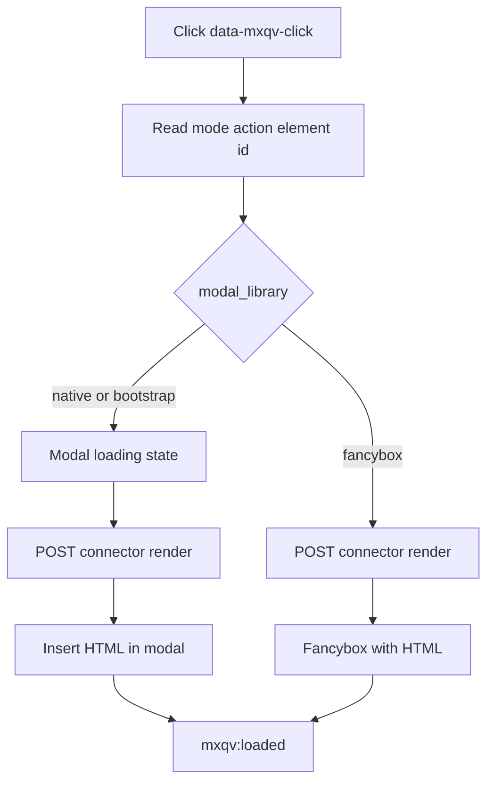

# Flows

## 1. Render in modal on click

For `native`/`bootstrap` the modal opens immediately (loading state), then POST is sent to `connector.php` (`action=render`, including `modal_library`).

For `fancybox` POST runs first, then Fancybox opens with the returned HTML.

On success HTML is inserted into the chosen mode container:

- `native` → `#mxqv-modal-body .qv-modal__content-area`
- `bootstrap` → `#mxqv-bootstrap-modal-body .qv-modal__content-area`
- `fancybox` → current Fancybox slide

After insert, `mxqv:loaded` is dispatched.

## 2. Render on mouseover

1. Hover over element with `data-mxqv-mouseover`.
2. Timer starts using `mouseoverDelay` from `window.mxqvConfig`.
3. If cursor is still there when timer ends, the same `render` request runs. Loop is not collected: prev/next and ←/→ do not work with `data-mxqv-mouseover`.
4. If cursor leaves earlier, timer is cancelled.

## 3. `selector` mode (no built-in modal)

1. Trigger has `data-mxqv-mode="selector"` and `data-mxqv-output`.
2. JS inserts loading indicator into the target container.
3. After response, replaces container content with `html` or error message.

## 4. Prev/next navigation in list

1. Trigger is inside container with `data-mxqv-parent data-mxqv-loop="true"`.
2. JS builds list of triggers inside that container.
3. Buttons `[data-mxqv-nav="prev|next"]` and ←/→ keys change current index (`modalLibrary` `native` or `bootstrap` only).
4. At list boundaries buttons are hidden. For Fancybox `updateNavButtons` is skipped; no prev/next.
5. **Escape** closes the modal only in `native` mode (not bootstrap/fancybox).

## 5. Add to cart from quick view

1. Render uses MiniShop3 form (`data-ms3-form`, `ms3_action=cart/add`).
2. After insert: `ms3.cartUI.init`/`reinit`, `ms3.quantityUI.reinit`/`init`, `ms3.productCardUI.reinit()` when MiniShop3 API is on the page.
3. Dispatches `ms3:cart:updated` with `detail: { source: 'mxqv' }`.
4. Add to cart without reload works when MiniShop3 is already initialized on the page.

## 6. ms3Variants inside quick view

1. Processor for `msProduct` adds `has_variants`, `variants_html` and `variants_json` (when ms3Variants is installed).
2. In chunk, `variants_json` is put in `data-mxqv-variants-json` via `:htmlent`.
3. JS finds `.qv-product[data-mxqv-variants]` and only handles flag `true|1|yes|on`.
4. JS listens for `click` on `[data-variant-id]` and `change` on `select/input` in `.qv-product__variants`.
5. On variant change it updates price, old price and image.
6. Variant handler (`initVariantsInContent`) runs on **modal** insert and in `mode=selector`.

## 7. Error flow

1. On validation error connector returns `{success:false, message, html:''}`.
2. In `modal` mode the message is shown in modal content.
3. In `selector` mode the message is inserted into the target container.
