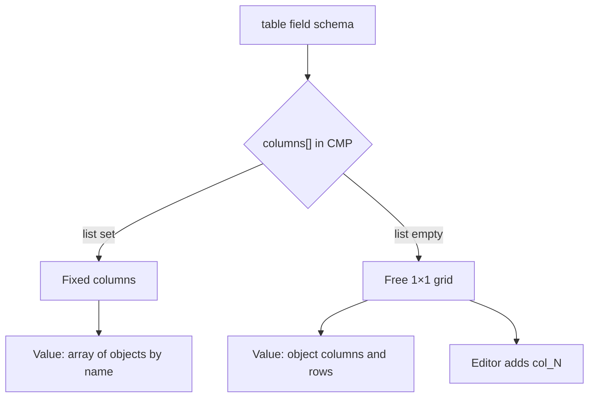

# Field table

Version: **Pro** (`advanced-fields`).

<!--  -->

## Why this type

The editor edits rows in an inspector grid. Columns can be text, number, image, color, date, tag, currency, or URL. Rows live in section data.

## When to use

- Product spec table
- Comparison matrix with images in cells
- A small set of characteristics in a section

## Tips

Empty `columns` gives a free 1×1 grid: the editor adds columns. A filled list locks `name`, `label`, and `type`, as in specs. The draft `key|Key|text` is no longer inserted when you pick the type. Large DB sets use [embeddedTable](embeddedTable).

Schema limits: `rows` (exact row count, wins over `maxRows`), `maxRows`, `columnCount` (exact column count, wins over `maxColumns`, free grid only), `maxColumns`, `columnWidth` (px), `headerDefault`.

## Similar types

- [keyvalue](keyvalue) for simple key/value pairs
- [embeddedTable](embeddedTable) for `table_key` and runtime rows

## Schema

```json
{
  "name": "specs",
  "type": "table",
  "label": "Specifications",
  "columns": [
    {
      "name": "key",
      "label": "Key",
      "type": "text"
    },
    {
      "name": "value",
      "label": "Value",
      "type": "text"
    }
  ],
  "tab": "Content",
  "width": 100,
  "active": true
}
```

## Value

With columns set: an array of objects keyed by `columns[].name`. An empty table with no extra rows is stored as `[]`.

Without columns: an object with `columns` and `rows`. New column keys are `col_1`, `col_2`. The label comes from `headerDefault` or “Column N”. In a free grid you edit it in the header. `columnCount` pads empty columns and keeps that count.



Inspector buttons use PrimeVue. **Add column** and **Remove column** stay on the toolbar. In a free grid they respect `columnCount` and `maxColumns`. When the type sets `columns[]`, the buttons stay visible and disabled. A status line under the toolbar explains the mode.

Below the editor grid sits a live preview: header, groups, `colspan`/`rowspan`, images and colors as on the site.

The column number sits above the label. The label’s left edge matches the cell control. Column width follows `type` (text grows, number is narrower, image and color are tight) unless `columnWidth` is set. Image thumbs are 40×40 beside the URL. Color is a 2.25rem square. Row number stays on the left. Row plus and minus stay on the right. **Clear** appears when cells have data. Group and CSV import share the toolbar. Merge right and down open on hover and focus.

- Columns are added only in a free grid.
- Removing a non-empty row or column, clearing, and CSV replace ask for confirmation.
- The grid never shrinks below 1×1.
- Group row: `"_pbGroup": true`, text in the first column.
- Merge lives in `"_span"` by column name (`label` / `value`). Cell text stays a string. On the site `TableCells::present()` adds `_pb_cells` (`hidden`, `colspan`, `rowspan`). For `spec_table` the same data is in `spec_rows`.

```fenom
{foreach $specs|pb_table:3 as $row}
  {$row.value|pb_text}
{/foreach}
{$specs|pb_table:'cell':'last':'last'}
```

`pb_table` slices rows: first argument is count, second is offset. Modes `row`, `column`, and `cell` take an index, a column name, `first`, or `last`.

## Section data {#output-in-section-data}

```json
{
  "specs": [
    {
      "key": "Weight",
      "value": "1.2 kg"
    },
    {
      "key": "Color",
      "value": "#111827"
    },
    {
      "key": "Photo",
      "value": {
        "url": "assets/images/hero.jpg",
        "id": 12,
        "path": "assets/images/",
        "filename": "hero.jpg",
        "extension": "jpg",
        "name": "hero",
        "title": "hero.jpg",
        "width": 1920,
        "height": 1080,
        "size": 245760,
        "type": "image"
      }
    }
  ]
}
```

- Cells with `type: image` store a media object, same as the `image` field.

Free grid:

```json
{
  "sheet": {
    "columns": [{ "name": "col_1", "label": "Column 1", "type": "text" }],
    "rows": [{ "col_1": "North" }]
  }
}
```

## Chunk example

Fenom loop. In MODX use a snippet or an indexed placeholder.

::: code-group

```modx
<div class="spec">
  <span class="spec__key">[[+specs.0.key]]</span>
  <span class="spec__value">[[+specs.0.value]]</span>
</div>
```

```fenom
{foreach $specs as $row}
  <div class="spec">
    <span class="spec__key">{$row.key|pb_text}</span>
    <span class="spec__value">{$row.value|pb_text}</span>
  </div>
{/foreach}
```

:::

## Notes

CMP columns: `columnsText` (`name|Label|type`). CMP hint: text, number, image, color, date, tag, currency, url. The inspector also opens `yesno`, `toggle`, `checkbox`, `colorpalette`, `time`, `datetime`.

## Common properties

For fields with `name` stored in section data:

| Key | Type | Role | CMP |
| --- | --- | --- | --- |
| `tab` | string | Group subtitle in the inspector | yes |
| `width` | 25, 33, 50, 66, 75, 100 | Field width as % of the row (flex); CMP only these values | yes |
| `description` | string | Hint under the label | yes |
| `default` | any | Initial value for a new section | yes |
| `active` | bool | `false` hides the field in the inspector | yes |
| `required` | bool | Required on **publish** (draft still saves) | yes |

- Also: `columns[]` (`name`, `label`, `type`) or an empty list for a free grid.

See [fields overview](overview#obshchie-svoystva-polya).

## See also

- [Field types reference](types)
- [Fields overview](overview)
- [Pro in manager](../integration)
