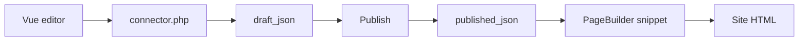

# Manager and events

## CMP


Manager component: **Components → PageBuilder** (namespace `pagebuilder`, controller `index`).

In the CMP:

- list of resources with sections
- open section editor
- **Section types** (permission `pagebuilder_manage_types`): UI types, hide/restore built-in JSON types

<!--  -->

- **Basket** (Pro, capability `basket`): global basket for deleted sections and table rows
- Collections tab settings when `pagebuilder_collections_*` are enabled

The editor on the resource form and in the CMP shares one Vue bundle via **VueTools**. Connector:

`assets/components/pagebuilder/connector.php`

## Data model

Main page record: table `pb_pages` (prefix `modx_pb_`).

| Field | Purpose |
| --- | --- |
| `resource_id` | Link to `modResource` |
| `draft_json` | Draft section document |
| `published_json` | Published version |
| `revision` | Draft revision number (optimistic locking) |
| `published_revision` | Last published revision |
| `publishedon` / `publishedby` | Publish time and user |
| `editedon` / `editedby` | Last draft edit |

PageBuilder does not overwrite `modResource.content`. Resource SEO fields (pagetitle, description) work as usual.

Per-page basket stores deleted sections in `document.trash`. On draft save, the plugin syncs the index in `pb_basket_items`. There is no dedicated basket `pbOn*` event: a plugin on `pbOnAfterSave` can read `record.draft.trash`. Global restore and permanent delete run through Pro processors `mgr/basket/*`.

Resource **data tables** live in separate `pb_*` tables (“Tables” tab).

<!--  -->

## PageBuilder Pro

The `pagebuilderpro` extra adds library, versions, presets, responsive fields, 20 advanced field types, global CMP basket, and [Agent API](agent-api).

Details: [PageBuilder Pro](pro). Commerce sections require **miniShop3**.

## Events

On install, the extra registers 20 `pbOn*` events in MODX. Subscribe a plugin under **System → Events** or use a static plugin from the package.

Exception: **`pbOnBeforeTableGetList`** and **`pbOnTableRowSave`** are not created by the installer. Add those events manually if your plugin needs table hooks.

### Boot registration

| Event | Data |
| --- | --- |
| `pbOnRegisterSectionDefinitions` | `registry` (`SectionRegistry`): add custom types |
| `pbOnRegisterFeatureProviders` | `registry` (`FeatureProviderRegistry`) |

### Page lifecycle

| Event | When |
| --- | --- |
| `pbOnBeforeSave` / `pbOnAfterSave` | Draft (`mode=draft`) |
| `pbOnBeforePublish` / `pbOnAfterPublish` | Publish |
| `pbOnBeforeUnpublish` / `pbOnAfterUnpublish` | Unpublish |
| `pbOnBeforeTrash` / `pbOnAfterTrash` | Move sections to the basket |

In `pbOnAfterSave` and similar: `changes` is `DocumentChangeSet` (added/removed/trashed/restored section ids).

### Copy

| Event | Data |
| --- | --- |
| `pbOnBeforeCopySections` | `sourceResourceId`, `targetResourceId`, `userId` |
| `pbOnAfterCopySections` | + `record` |

### Catalog and fields

| Event | Purpose |
| --- | --- |
| `pbOnBeforeGetList` / `pbOnAfterGetList` | Catalog list |
| `pbOnFieldValues` | `FieldValuesBag`: field value substitution |
| `pbOnCheckSectionRequirement` | `requirement`, `result.satisfied`: check depends (pro, minishop3) |
| `pbOnCheckSectionVisibility` | Pro: `settings.conditions`, `result.visible` — section visibility on the front |

### Tabular resource data

::: warning Manual registration
The events below are **not** registered on install. Add them under **System → Events** if your plugin should handle them.
:::

| Event | When |
| --- | --- |
| `pbOnBeforeTableGetList` | Row filtering (`criteria` by ref) |
| `pbOnTableRowSave` | Before row save (`data` by ref) |

### Frontend render

| Event | Data |
| --- | --- |
| `pbOnBeforeRenderDocument` | `resourceId`, `document`, `pipeline`, `options` |
| `pbOnBeforeRenderSection` | `index`, `pipeline`: mutate section before chunk |
| `pbOnGetValues` | When snippet `return_values=1` |

Example: register a section in a plugin:

```php
<?php
switch ($modx->event->name) {
    case 'pbOnRegisterSectionDefinitions':
        /** @var \PageBuilder\Section\SectionRegistry $registry */
        $registry = $modx->event->params['registry'];
        $registry->registerFromFile($modx->getOption('core_path') . 'components/mypackage/sections/custom.json');
        break;
}
```

Custom JSON definitions must match built-in section schema (fields, chunk, category).

## Save, publish, and frontend output

The editor writes the draft via connector, publish copies the snapshot to `published_json`, and the site snippet reads only the published version.



## Related pages

- [Workflow](workflow)
- [CMP](cmp)
- [PageBuilder Pro](pro)
- [Agent API](agent-api)
- [Developer](developer)
- [Quick start](quick-start)
- [Section catalog](sections/)
- [FAQ](faq)
