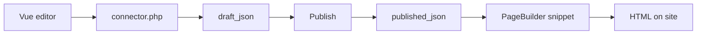

# Manager and events

## Control panel


Manager component: **Components → PageBuilder** (namespace `pagebuilder`, controller `index`).

In the control panel:

- list of resources with sections
- jump to section editor
- **Section types** (permission `pagebuilder_manage_types`): UI types, hide and restore built-in JSON types

<!--  -->

- **Basket** (Pro, flag `basket`): global basket for deleted sections and table rows
- Collections tab settings when `pagebuilder_collections_*` are enabled

The editor on the resource form and in the control panel uses one Vue bundle via **VueTools**. Manager API entry:

`assets/components/pagebuilder/connector.php`

## Data model

Main page record: table `pb_pages` (prefix `modx_pb_`).

| Field | Purpose |
| --- | --- |
| `resource_id` | Link to `modResource` |
| `draft_json` | Section document draft |
| `published_json` | Published version |
| `revision` | Draft revision number (optimistic locking) |
| `published_revision` | Last publish revision |
| `publishedon` / `publishedby` | Publish time and user |
| `editedon` / `editedby` | Last draft change |

PageBuilder does not overwrite `modResource.content`. Resource SEO fields (pagetitle, description) are used as usual.

Page basket stores deleted sections in `document.trash`. On draft save a plugin syncs index `pb_basket_items`. There is no separate `pbOn*` event for basket: a plugin on `pbOnAfterSave` can read `record.draft.trash`. Global restore and permanent delete use Pro connector actions (`mgr/basket/*`).

Resource table data lives in separate `pb_*` tables (Tables tab).

<!--  -->

## PageBuilder Pro

The `pagebuilderpro` extra adds shared blocks, section journal, catalog examples, breakpoint fields, 27 advanced field types, global basket in the control panel, and [Agent API](agent-api).

Details: [PageBuilder Pro](pro). Storefront sections require **miniShop3**.

## Events {#events}

On install the extra registers 20 `pbOn*` events in MODX. Subscribe a plugin under **System → Events** or use the static plugin from the package.

Exception: **`pbOnBeforeTableGetList`** and **`pbOnTableRowSave`** are not created by the installer. Add events manually if your plugin should react.

### Registration on boot

| Event | Data |
| --- | --- |
| `pbOnRegisterSectionDefinitions` | `registry`: `SectionRegistry`, add custom types |
| `pbOnRegisterFeatureProviders` | `registry`: `FeatureProviderRegistry` |

### Page lifecycle

| Event | When | Data |
| --- | --- | --- |
| `pbOnBeforeSave` | Before the draft is stored | `resourceId`, `document`, `documentBag`, `revision`, `userId`, `mode`=`draft`, `changes` |
| `pbOnAfterSave` | After the draft is stored | `resourceId`, `record`, `userId`, `mode`=`draft`, `changes` |
| `pbOnBeforePublish` | Before publish | `resourceId`, `document`, `revision`, `userId` |
| `pbOnAfterPublish` | After publish | `resourceId`, `record`, `userId` |
| `pbOnBeforeUnpublish` | Before unpublish | `resourceId`, `record`, `revision`, `userId` |
| `pbOnAfterUnpublish` | After unpublish | `resourceId`, `record`, `userId` |
| `pbOnBeforeTrash` | Before trash, only when sections were removed | `resourceId`, `sectionIds`, `document`, `userId` |
| `pbOnAfterTrash` | After the draft save, same ids | `resourceId`, `sectionIds`, `record`, `userId` |

`documentBag` is a `PageDocumentBag`. A listener replaces the document before `saveDraft`. `changes` is the `DocumentChangeSet` array: `addedSectionIds`, `removedSectionIds`, `trashedSectionIds`, `restoredSectionIds`, `updatedSectionIds`, `enabledSectionIds`, `disabledSectionIds`. Trash events run inside the same `saveDraft`. There is no separate trash action.

### Copy

| Event | Data |
| --- | --- |
| `pbOnBeforeCopySections` | `sourceResourceId`, `targetResourceId`, `userId` |
| `pbOnAfterCopySections` | + `record` |

### Catalog and fields

| Event | Data |
| --- | --- |
| `pbOnBeforeGetList` | `resourceContext` |
| `pbOnAfterGetList` | `resourceContext`, `items`, `result` (`FieldValuesBag`, key `items`) |
| `pbOnFieldValues` | Catalog: `resourceContext`, `fieldValues`. In `mgr/field/options`: `field`, `fieldValues` |
| `pbOnCheckSectionRequirement` | `requirement`, `result` (`FieldValuesBag`, key `satisfied`) |
| `pbOnCheckSectionVisibility` | `section`, `conditions`, `result` (`FieldValuesBag`, key `visible`) |

### Resource table data

::: warning Manual registration
Events below are **not** registered on install. Add them under **System → Events** if your plugin should react.
:::

| Event | Data |
| --- | --- |
| `pbOnBeforeTableGetList` | `table`, `query`, `criteria` by reference |
| `pbOnTableRowSave` | `table`, `data` by reference, `row_id` |

### Frontend render {#frontend-render}

| Event | Data |
| --- | --- |
| `pbOnBeforeRenderDocument` | `resourceId`, `document`, `pipeline`, `options` |
| `pbOnBeforeRenderSection` | `resourceId`, `pipeline` with one section, `index`, `options` |
| `pbOnGetValues` | `resourceId`, `document`, `values` (`SectionValuesBag`). The snippet when `return_values=1`, and Public API when `include` contains `values` |

Example section registration in a plugin:

```php
<?php
switch ($modx->event->name) {
    case 'pbOnRegisterSectionDefinitions':
        /** @var \PageBuilder\Section\SectionRegistry $registry */
        $registry = $modx->event->params['registry'];
        $registry->registerFromFile($modx->getOption('core_path') . 'components/mypackage/sections/custom.json');
        break;
}
```

Custom JSON definitions must match built-in section schema: fields, chunk, category.

## Save, publish, and frontend output

The editor writes the draft via connector, publish copies snapshot to `published_json`, the site snippet reads only the published version.



## Related pages

- [Workflow](workflow)
- [Control panel](cmp)
- [PageBuilder Pro](pro)
- [Agent API](agent-api)
- [Developer](developer)
- [Quick start](quick-start)
- [Section catalog](sections/)
- [FAQ](faq)
