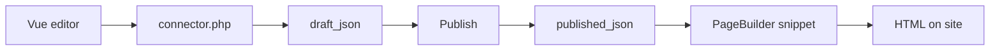

# Manager and events

## Control panel


Manager component: **Components → PageBuilder** (namespace `pagebuilder`, controller `index`).

In the control panel:

- list of resources with sections
- jump to section editor
- **Section types** (permission `pagebuilder_manage_types`): UI types, hide and restore built-in JSON types

<!--  -->

- **Basket** (Pro, flag `basket`): global basket for deleted sections and table rows
- Collections tab settings when `pagebuilder_collections_*` are enabled

The editor on the resource form and in the control panel uses one Vue bundle via **VueTools**. Manager API entry:

`assets/components/pagebuilder/connector.php`

## Data model

Main page record: table `pb_pages` (prefix `modx_pb_`).

| Field | Purpose |
| --- | --- |
| `resource_id` | Link to `modResource` |
| `draft_json` | Section document draft |
| `published_json` | Published version |
| `revision` | Draft revision number (optimistic locking) |
| `published_revision` | Last publish revision |
| `publishedon` / `publishedby` | Publish time and user |
| `editedon` / `editedby` | Last draft change |

PageBuilder does not overwrite `modResource.content`. Resource SEO fields (pagetitle, description) are used as usual.

Page basket stores deleted sections in `document.trash`. On draft save a plugin syncs index `pb_basket_items`. There is no separate `pbOn*` event for basket: a plugin on `pbOnAfterSave` can read `record.draft.trash`. Global restore and permanent delete use Pro connector actions (`mgr/basket/*`).

Resource table data lives in separate `pb_*` tables (Tables tab).

<!--  -->

## PageBuilder Pro

The `pagebuilderpro` extra adds shared blocks, section journal, catalog examples, breakpoint fields, 20 advanced field types, global basket in the control panel, and [Agent API](agent-api).

Details: [PageBuilder Pro](pro). Storefront sections require **miniShop3**.

## Events {#events}

On install the extra registers 20 `pbOn*` events in MODX. Subscribe a plugin under **System → Events** or use the static plugin from the package.

Exception: **`pbOnBeforeTableGetList`** and **`pbOnTableRowSave`** are not created by the installer. Add events manually if your plugin should react.

### Registration on boot

| Event | Data |
| --- | --- |
| `pbOnRegisterSectionDefinitions` | `registry`: `SectionRegistry`, add custom types |
| `pbOnRegisterFeatureProviders` | `registry`: `FeatureProviderRegistry` |

### Page lifecycle

| Event | When |
| --- | --- |
| `pbOnBeforeSave` / `pbOnAfterSave` | Draft (`mode=draft`) |
| `pbOnBeforePublish` / `pbOnAfterPublish` | Publish |
| `pbOnBeforeUnpublish` / `pbOnAfterUnpublish` | Unpublish |
| `pbOnBeforeTrash` / `pbOnAfterTrash` | Move sections to basket |

In `pbOnBeforeSave` extensions can replace the document via `PageDocumentBag`. In `pbOnAfterSave` and similar, field `changes` contains `DocumentChangeSet` (ids of sections added, removed, trashed, restored, enabled, and disabled).

### Copy

| Event | Data |
| --- | --- |
| `pbOnBeforeCopySections` | `sourceResourceId`, `targetResourceId`, `userId` |
| `pbOnAfterCopySections` | + `record` |

### Catalog and fields

| Event | Purpose |
| --- | --- |
| `pbOnBeforeGetList` / `pbOnAfterGetList` | Catalog list (`mgr/catalog/list`) |
| `pbOnFieldValues` | `FieldValuesBag`: field value substitution (`mgr/field/options`, picker) |
| `pbOnCheckSectionRequirement` | `requirement`, `result.satisfied`: check depends (pro, minishop3) |
| `pbOnCheckSectionVisibility` | Pro: `settings.conditions`, `result.visible`, section visibility on frontend |

### Resource table data

::: warning Manual registration
Events below are **not** registered on install. Add them under **System → Events** if your plugin should react.
:::

| Event | When |
| --- | --- |
| `pbOnBeforeTableGetList` | Filter rows (`criteria` passed by reference) |
| `pbOnTableRowSave` | Before row save (`data` passed by reference) |

### Frontend render {#frontend-render}

| Event | Data |
| --- | --- |
| `pbOnBeforeRenderDocument` | `resourceId`, `document`, `pipeline`, `options` |
| `pbOnBeforeRenderSection` | `index`, `pipeline`: mutate section before chunk |
| `pbOnGetValues` | When snippet has `return_values=1` |

Example section registration in a plugin:

```php
<?php
switch ($modx->event->name) {
    case 'pbOnRegisterSectionDefinitions':
        /** @var \PageBuilder\Section\SectionRegistry $registry */
        $registry = $modx->event->params['registry'];
        $registry->registerFromFile($modx->getOption('core_path') . 'components/mypackage/sections/custom.json');
        break;
}
```

Custom JSON definitions must match built-in section schema: fields, chunk, category.

## Save, publish, and frontend output

The editor writes the draft via connector, publish copies snapshot to `published_json`, the site snippet reads only the published version.



## Related pages

- [Workflow](workflow)
- [Control panel](cmp)
- [PageBuilder Pro](pro)
- [Agent API](agent-api)
- [Developer](developer)
- [Quick start](quick-start)
- [Section catalog](sections/)
- [FAQ](faq)
