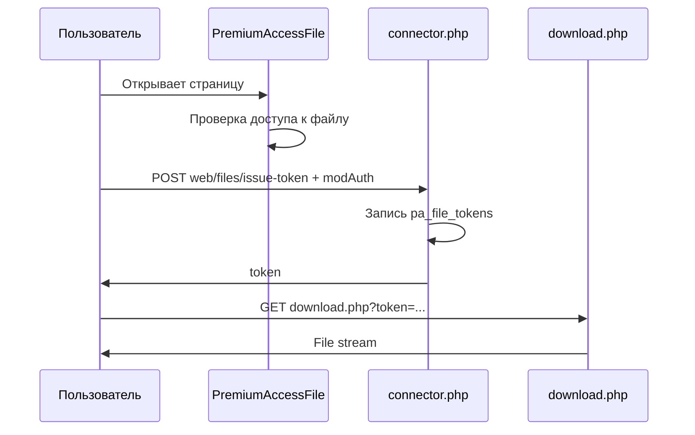

<!-- TODO: translate from docs/components/premiumaccess/frontend/protected-files.md -->

# Защищённые файлы

Файлы лежат в **`premiumaccess.protected_path`**. Прямой URL к каталогу закрыт. Скачивание только через одноразовый token.

## Настройка хранилища

1. **Настройки** или `premiumaccess.protected_path` — путь **вне document root**.

   По умолчанию: `{core_path}uploads/protected/`

2. Создайте каталог, права на запись для PHP.

3. На web server запретите HTTP-доступ к каталогу (nginx `deny all`, Apache `Require all denied`).

## Правило на файл

**Правила → Создать**:

| Поле | Значение |
| --- | --- |
| `target_type` | `file` |
| `target_identifier` | Относительный путь, напр. `courses/guide.pdf` |
| `product_id` | Тариф, который открывает файл |

Или загрузка через **`mgr/files/upload`**, затем правило с тем же path.

У пользователя должен быть **активный доступ** к тарифу из правила (оплата MS3, ручная выдача или промокод).

## Вывод на странице

::: code-group

```fenom
{'!PremiumAccessFile' | snippet : ['file' => 'courses/guide.pdf']}
```

```modx
[[!PremiumAccessFile? &file=`courses/guide.pdf`]]
```

:::

| Состояние | Chunk |
| --- | --- |
| Доступ есть | `paFileDownload` — форма POST issue-token |
| Доступа нет | `paFileLocked` |

## Поток скачивания



1. Проверка доступа к файлу (`target_type=file`).
2. POST `{assets_url}components/premiumaccess/connector.php`:
   - `action=web/files/issue-token`
   - `file=courses/guide.pdf`
   - `HTTP_MODAUTH` — token пользователя web-контекста (CSRF)
3. Token TTL: **`premiumaccess.download_token_ttl`** (по умолчанию 300 сек).
4. Redirect или form action: `assets/components/premiumaccess/download.php?token=…`
5. Token одноразовый; повторное использование → 403.

## Плейсхолдеры paFileDownload

| Плейсхолдер | Назначение |
| --- | --- |
| `[[+connectorUrl]]` | URL connector |
| `[[+file]]` | Идентификатор файла |
| `[[+modAuth]]` | CSRF-токен |
| `[[+actionLabel]]` | Текст кнопки |

## Несколько файлов одним тарифом

Вариант A: несколько правил «файл» с одним `product_id`.

Вариант B: файлы в **группе доступа**, правило с типом `group`.

## Безопасность

| Риск | Мера |
| --- | --- |
| Обход пути | Identifier нормализуется; `..` отклоняется |
| Прямые ссылки | Token + короткий TTL |
| Прямой URL | Storage вне web root |
| CSRF issue-token | `modAuth` обязателен |

HTTPS для connector и download.

## Диагностика 403

1. Правило «файл» включено, путь совпадает.
2. У пользователя **активный доступ** к тарифу из правила.
3. Файл существует в `protected_path`.
4. Token не истёк.
5. `premiumaccess.enabled` = Да.

## См. также

- [PremiumAccessFile](../snippets/PremiumAccessFile)
- [Системные настройки — security](../settings#безопасность-premiumaccess_security)
- [FAQ](../faq)
