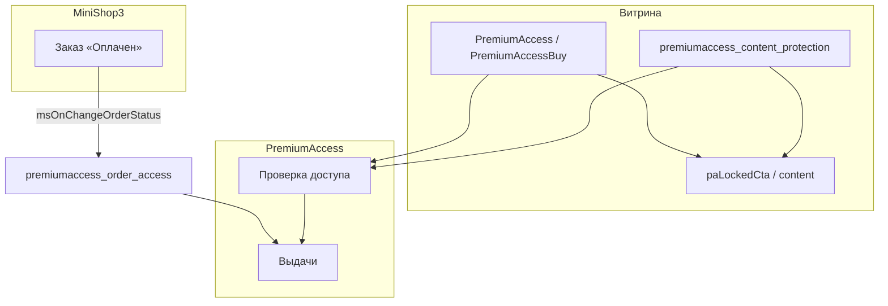

<!-- TODO: translate from docs/components/premiumaccess/index.md -->

# PremiumAccess

**PremiumAccess** закрывает страницы, premium blocks и файлы на [MODX Revolution 3](https://modx.com/) и [MiniShop3](/components/minishop3/). Покупатель оплачивает товар в miniShop3 — компонент выдаёт доступ. Без активного доступа платный HTML не попадает в ответ страницы.

С чего начать: [Быстрый старт](quick-start).

## Минимальный путь

1. Установить **MiniShop3**, **VueTools** и **PremiumAccess** через ModStore.
2. Проверить плагины `premiumaccess_autoload`, `premiumaccess_order_access`, `premiumaccess_content_protection`.
3. Создать товар MS3 и **тариф** PremiumAccess с тем же `ms_product_id`.
4. Привязать тариф на страницу (**Ресурсы**) или пройти [Мастер](interface/wizard).
5. Задать `premiumaccess.paid_order_statuses` в **Настройках**.
6. Очистить кэш и проверить paywall на витрине.

## Быстрые ссылки

| Нужно | Документ |
| --- | --- |
| Пошаговая установка | [Быстрый старт](quick-start) |
| Ключи `premiumaccess_*` | [Системные настройки](settings) |
| Мастер: тариф и правила за один проход | [Мастер доступа](interface/wizard) |
| Типы правил и сроки доступа | [Продукты и правила](interface/products-and-rules) |
| Покупка MS3, выдача и отзыв | [Интеграция](integration) |
| Как проверяется доступ | [Интеграция — проверка доступа](integration#алгоритм-checkaccess) |
| Paywall в шаблоне | [Paywall на страницах](frontend/paywall) |
| Premium blocks `[[pa-block:uuid]]` | [Ресурсы и blocks](interface/resources-and-blocks) |
| PDF и скачивание по token | [Защищённые файлы](frontend/protected-files) |
| Промокоды | [Доступы и промокоды](interface/accesses-and-clients#промокоды) |
| OnPaAccessGrant и webhook | [События MODX](development/events) |
| Диагностика | [FAQ](faq) |

## Возможности

- **Движок доступа** — проверка перед показом, контент закрыт по умолчанию, кэш отказов, журнал
- **SPA менеджера** (Vue 3 + PrimeVue 4): панель, продукты, правила, группы, мастер, ресурсы, premium blocks, промокоды, доступы, журнал, настройки
- **miniShop3** — выдача и отзыв по статусам заказа; оформление заказа только через MS3
- **Paywall** — плагин `premiumaccess_content_protection` или сниппет `PremiumAccess`
- **Premium blocks** — маркер `[[pa-block:uuid]]` в content ресурса
- **Защищённые файлы** — хранение вне web root, скачивание по token через `download.php`
- **Личный кабинет** — `PremiumAccessCabinet`, статусы Активен / Истёк / Отозван
- **Промокоды** — создание в менеджере, активация на сайте через форму
- **Продление** — кнопка «Продлить» и email-напоминание; повторная покупка в MS3, без автосписания
- **Уведомления** — email, webhook, Telegram; cron истечения и CLI

## Системные требования

| Требование | Версия |
| --- | --- |
| MODX Revolution | 3.0+ |
| PHP | 8.2+ |
| MiniShop3 | 1.0+ |
| VueTools | 1.1.2-pl+ |

### Зависимости

- **[MiniShop3](/components/minishop3/)** — товар в корзине, оформление заказа, статусы заказа
- **[VueTools](/components/vuetools/)**

### Рекомендуется

- **[pdoTools](/components/pdotools/)** 3.x — Fenom-модификаторы `pa_access`, `pa_resource_access`

## Установка

1. [Подключите репозиторий ModStore](https://modstore.pro/info/connection).
2. Установите **MiniShop3** и **VueTools**.
3. **Extras → Installer → Download Extras** — **PremiumAccess** → **Download** → **Install**.
4. **Настройки → Очистить кэш**.

После установки проверьте включённые плагины — список в [Быстром старте](quick-start#после-установки).

## Термины

| Термин | Что это |
| --- | --- |
| **Тариф** | Название, срок, цена для закрытой страницы, ID товара MS3 |
| **Правило** | Связь «тариф → страница / файл / блок» |
| **Группа** | Несколько страниц или файлов одним тарифом |
| **Выдача доступа** | У пользователя есть тариф: после оплаты, вручную или по промокоду |
| **Premium block** | Платный фрагмент внутри открытой статьи (маркер `[[pa-block:uuid]]`) |
| **Статус доступа** | Активен / Истёк / Отозван — считается по датам, отдельного поля в форме нет |

## Модель данных (кратко)

| Таблица | Назначение |
| --- | --- |
| `pa_access_products` | Продукты доступа |
| `pa_access_rules` | Правила product → target |
| `pa_access_groups` / `pa_access_group_items` | Группы объектов |
| `pa_user_accesses` | Выдачи пользователям |
| `pa_premium_blocks` | Premium blocks (UUID + HTML) |
| `pa_promo_codes` | Промокоды |
| `pa_file_tokens` | Одноразовые токены скачивания |
| `pa_access_logs` | Журнал аудита |

## Архитектура

Подробнее: [Интеграция](integration), [Интерфейс менеджера](interface/index).
