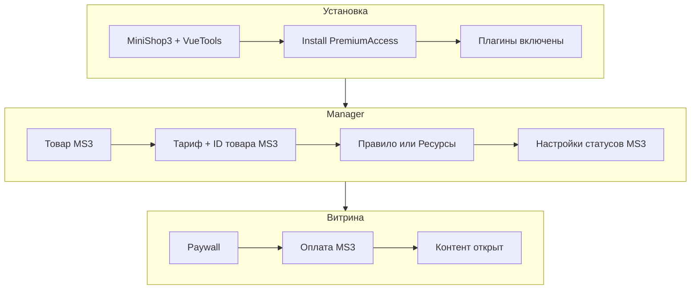

<!-- TODO: translate from docs/components/premiumaccess/quick-start.md -->

# Быстрый старт

Полный сценарий: товар в miniShop3 → тариф в PremiumAccess → правило на страницу → закрытая страница → оплата → контент открыт.



## Требования

| Требование | Версия |
| --- | --- |
| MODX Revolution | 3.0+ |
| PHP | 8.2+ |
| MiniShop3 | 1.0+ |
| VueTools | 1.1.2-pl+ |

## Шаг 1: Установка пакета

1. [Подключите ModStore](https://modstore.pro/info/connection).
2. Установите **[MiniShop3](/components/minishop3/)** и **[VueTools](/components/vuetools/)**.
3. **Extras → Installer → Download Extras** — **PremiumAccess** → **Download** → **Install**.
4. **Настройки → Очистить кэш**.

### После установки {#после-установки}

| Элемент | Ожидание |
| --- | --- |
| Меню | **Компоненты → PremiumAccess** (SPA) |
| Namespace | `premiumaccess` в системных настройках |
| Таблицы | `pa_access_products`, `pa_access_rules`, `pa_user_accesses`, … |
| Плагины (вкл.) | `premiumaccess_autoload`, `premiumaccess_order_access`, `premiumaccess_content_protection`, `premiumaccess_fenom`, `premiumaccess_front_assets` |
| Уведомления (плагины вкл., оповещения выкл.) | `premiumaccess_notifications`, `premiumaccess_expire_cron` |
| Сниппеты | `PremiumAccess`, `PremiumAccessBuy`, `PremiumAccessFile`, `PremiumAccessCabinet`, `PremiumAccessPromoRedeem`, `PremiumAccessRenew`, `PremiumAccessSubscription` |

SPA не открывается без VueTools — см. [FAQ](faq#spa-не-открывается).

## Шаг 2: Товар miniShop3

1. **MiniShop3 → Товары → Создать** (класс `msProduct`).
2. Заполните название, цену, опубликован.
3. Запомните **ID товара** (например `160`).

Этот ID укажите в тарифе PremiumAccess (поле **ID товара MS3**). Оформление и оплата — через miniShop3.

Задайте системные настройки MS3:

| Ключ MS3 | Назначение |
| --- | --- |
| `ms3_cart_page_id` | Страница корзины |
| `ms3_order_page_id` | Страница оформления заказа |

Скрипты miniShop3 (`ms3.js` и др.) подключаются **автоматически** на каждой странице web-контекста — плагин miniShop3 на `OnLoadWebDocument`. Ручная вставка в layout не нужна. Подробнее: [Корзина — подключение скриптов](/components/minishop3/frontend/cart#подключение-скриптов).

## Шаг 3: Тариф и правило на страницу

**Компоненты → PremiumAccess**.

### Вариант A — Мастер

1. **Мастер** — название тарифа, цена для закрытой страницы, срок, **ID товара MS3** из шага 2.
2. Выберите страницы, которые нужно закрыть.
3. **Создать**.

Подробнее: [Мастер доступа](interface/wizard).

### Вариант B — Ресурсы

1. **Продукты** — создайте тариф с тем же **ID товара MS3**.
2. **Ресурсы** — выберите страницу → **Привязать тариф**.

Подробнее: [Продукты и правила](interface/products-and-rules).

## Шаг 4: Настройки заказа

**Компоненты → PremiumAccess → Настройки**:

| Ключ | По умолчанию | Проверьте |
| --- | --- | --- |
| `premiumaccess.enabled` | Да | Включено |
| `premiumaccess.paid_order_statuses` | `3` | Совпадает со статусом «Оплачен» MS3 (`ms3_status_paid`) |
| `premiumaccess.revoked_order_statuses` | `5` | Статусы отмены/возврата MS3 |

Списки оплаченных и отменённых **не пересекаются**.

::: warning
Статус «Новый» MS3 не должен быть в `paid_order_statuses`. Выдача доступа только после реальной оплаты.
:::

Полный список: [Системные настройки](settings).

## Шаг 5: Paywall на витрине

Плагин **`premiumaccess_content_protection`** закрывает страницу автоматически — отдельный сниппет на каждой странице не обязателен.

Проверка как **гость**:

1. Откройте защищённую страницу.
2. Видите закрытый CTA (цена, срок, кнопка).
3. В исходном коде страницы нет полного платного текста — только закрытый блок (CTA).

Кнопка покупки (если не в CTA):

::: code-group

```fenom
{'!PremiumAccessBuy' | snippet : ['resourceId' => $_modx->resource.id]}
```

```modx
[[!PremiumAccessBuy? &resourceId=`[[*id]]`]]
```

:::

Детали: [Paywall на страницах](frontend/paywall).

## Шаг 6: Покупка и выдача доступа

1. Нажмите **Купить доступ** — товар попадёт в корзину MS3.
2. Оформите и оплатите заказ (для теста можно вручную сменить статус заказа на «Оплачен» в miniShop3).
3. **Компоненты → PremiumAccess → Доступы** — появится запись с источником «заказ miniShop3».
4. Тот же пользователь обновляет страницу — видит полный контент.

При отмене или возврате заказа доступ закроется, если статус заказа входит в список отменённых в настройках PremiumAccess.

Схема: [Интеграция — покупка](integration#как-происходит-покупка-доступа).

## Шаг 7: Кабинет (опционально)

Ресурс «Мои доступы»:

::: code-group

```fenom
{'!PremiumAccessCabinet' | snippet}
```

```modx
[[!PremiumAccessCabinet]]
```

:::

[Личный кабинет](frontend/cabinet).

## Шаг 8: Защищённый файл (опционально)

1. Положите файл в каталог из настройки защищённых файлов.
2. Создайте правило на файл и выведите [PremiumAccessFile](snippets/PremiumAccessFile) на странице.

[Защищённые файлы](frontend/protected-files).

## Дальше

- [Интерфейс SPA](interface/index)
- [Premium blocks](interface/resources-and-blocks)
- [Промокоды](interface/accesses-and-clients#промокоды)
- [Уведомления и cron](integration#уведомления-и-cron-истечения)
- [FAQ](faq)
