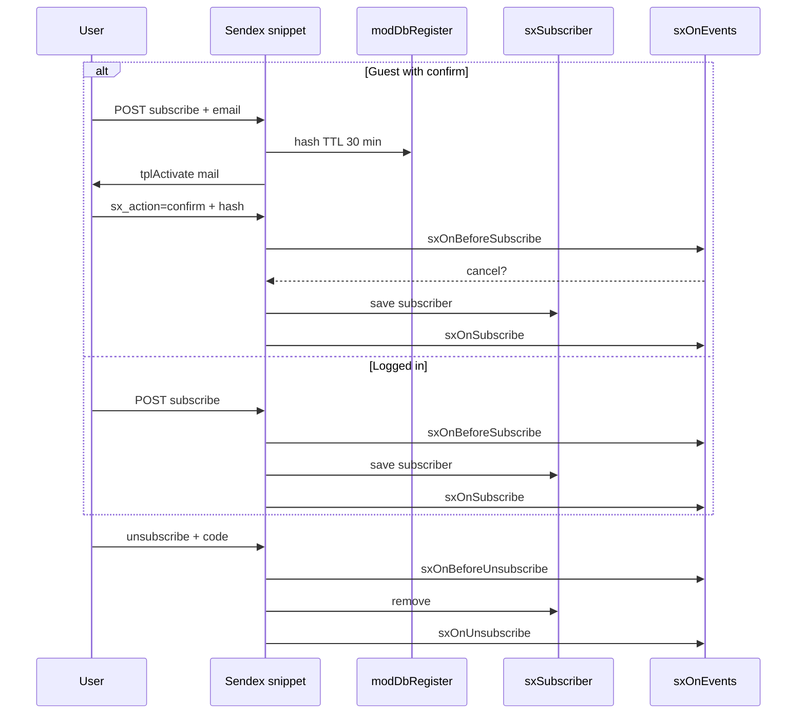
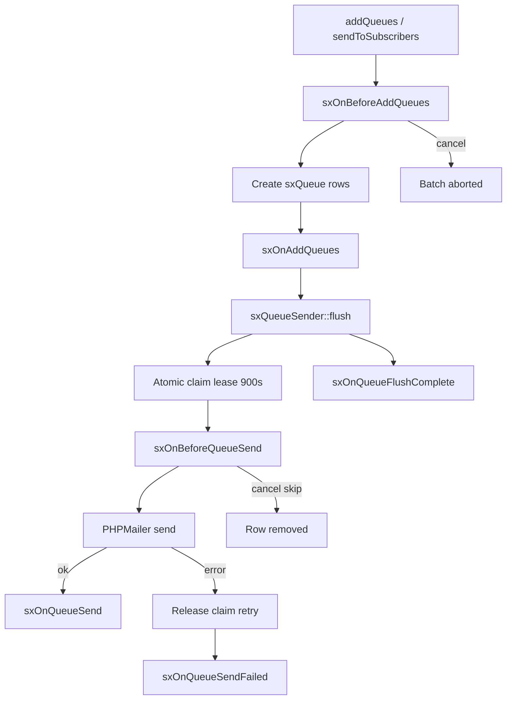

# Events

Sendex registers `sxOn*` system events on package install. After upgrade, reinstall the package via **Extras → Installer** if events are missing under **Manage → System events**.

## Plugin setup

1. **Elements → Plugins → Create**
2. **System events** tab — check the `sxOn*` events you need
3. Paste PHP code into the plugin
4. Save and clear the MODX cache

Cancel a Before event: `$modx->event->output('error message')`. The user sees that text; the operation aborts.

::: tip
Calling `$modx->invokeEvent('sxOnSubscribe', …)` by name works even before transport registration, but explicit plugin subscription is easier to manage.
:::

## Subscribe and unsubscribe flow



Re-subscribe, invalid `code`, or mismatched `newsletter_id` — the operation is ignored, events **do not fire**.

## Subscribe and unsubscribe

| Event | When | Cancel |
| --- | --- | --- |
| `sxOnBeforeSubscribe` | Before creating a subscriber | yes |
| `sxOnSubscribe` | After successful save | no |
| `sxOnBeforeUnsubscribe` | Before removing a subscriber | yes |
| `sxOnUnsubscribe` | After successful remove | no |

### Subscribe / unsubscribe parameters

| Parameter | BeforeSubscribe | Subscribe | BeforeUnsubscribe | Unsubscribe |
| --- | --- | --- | --- | --- |
| `newsletter` | yes | yes | yes | yes |
| `newsletter_id` | yes | yes | yes | yes |
| `user_id` | yes | yes | yes | yes |
| `email` | yes | yes | yes | yes |
| `subscriber` | `null` | object | object | object |
| `source` | yes | yes | yes | yes |
| `code` | — | — | yes | yes |

### `source` values

| Value | Description |
| --- | --- |
| `snippet` | Normal form POST |
| `ajax` | AJAX request |
| `confirm` | Email confirmation link |
| `guest` | Instant guest subscribe without confirm |
| `mgr` | Manager action |
| `group` | Bulk group subscribe (**events not fired**) |

## Email queue flow



## Email queue

| Event | When | Cancel |
| --- | --- | --- |
| `sxOnBeforeAddQueues` | Before building the queue | yes (whole batch) |
| `sxOnAddQueues` | After queue rows created | no |
| `sxOnBeforeQueueSend` | Before sending one row (after claim) | yes (row removed, no requeue) |
| `sxOnQueueSend` | After successful send | no |
| `sxOnQueueSendFailed` | After SMTP error (claim released) | no |
| `sxOnQueueFlushComplete` | After batch flush | no |

### Queue parameters

| Event | Parameters |
| --- | --- |
| `sxOnBeforeAddQueues` | `newsletter`, `subscribers` (array, **mutable**) |
| `sxOnAddQueues` | `newsletter`, `created` (new row count) |
| `sxOnBeforeQueueSend` | `queue`, `message` (headers+body array, **mutable**) |
| `sxOnQueueSend` | `queue`, `message` |
| `sxOnQueueSendFailed` | `queue`, `error` (string) |
| `sxOnQueueFlushComplete` | `newsletter_id`, `stats` (`sent`, `skipped`, `failed`, `firstError`) |

On `sxOnBeforeQueueSend` a plugin may change `$scriptProperties['message']` before send. Cancel via `$modx->event->output()` — row is removed with **no** requeue.

## MODX events (Sendex plugin)

| MODX event | Behavior |
| --- | --- |
| `OnManagerPageInit` | Manager CSS |
| `OnUserActivate` | Merge guest subscribers onto user by email |
| `OnUserSave` | Same on user save |

`OnBeforeUserActivate` is **not used** — cancelled activation must not attach guest rows.

## Plugin examples

### Block a domain

```php
<?php
switch ($modx->event->name) {
    case 'sxOnBeforeSubscribe':
        $email = $modx->event->getParam('email');
        if (preg_match('/@spam\.example$/i', (string) $email)) {
            $modx->event->output('Subscriptions from this domain are blocked');
        }
        break;
}
```

### Log subscriptions

```php
<?php
switch ($modx->event->name) {
    case 'sxOnSubscribe':
        $modx->log(
            modX::LOG_LEVEL_INFO,
            '[Sendex] subscribe: ' . $modx->event->getParam('email')
            . ' newsletter=' . $modx->event->getParam('newsletter_id')
            . ' source=' . $modx->event->getParam('source')
        );
        break;
    case 'sxOnUnsubscribe':
        $modx->log(
            modX::LOG_LEVEL_INFO,
            '[Sendex] unsubscribe: ' . $modx->event->getParam('email')
        );
        break;
}
```

### Filter subscribers before queue

```php
<?php
if ($modx->event->name !== 'sxOnBeforeAddQueues') {
    return;
}

$subscribers = $modx->event->getParam('subscribers');
if (!is_array($subscribers)) {
    return;
}

$filtered = array();
foreach ($subscribers as $subscriber) {
    if (strpos((string) $subscriber->get('email'), '@internal.local') !== false) {
        continue;
    }
    $filtered[] = $subscriber;
}

$modx->event->setParam('subscribers', $filtered);
```

### Personalize email subject

```php
<?php
if ($modx->event->name !== 'sxOnBeforeQueueSend') {
    return;
}

$message = $modx->event->getParam('message');
if (!is_array($message)) {
    return;
}

$queue = $modx->event->getParam('queue');
$attempts = $queue ? (int) $queue->get('attempts') : 0;
if ($attempts > 1) {
    $message['subject'] = '[retry] ' . $message['subject'];
}

$modx->event->setParam('message', $message);
```

### Alert on SMTP failure

```php
<?php
if ($modx->event->name !== 'sxOnQueueSendFailed') {
    return;
}

$error = $modx->event->getParam('error');
$queue = $modx->event->getParam('queue');
$modx->log(
    modX::LOG_LEVEL_ERROR,
    '[Sendex] queue id ' . ($queue ? $queue->get('id') : '?') . ': ' . $error
);
```

## Related

- [FAQ](../faq) — common subscribe and queue issues
- [PHP API](api) — subscribe and queue from code
- [Email queue](../interface/queue) — claim, retry, cron
- [Sendex snippet](../snippets/sendex) — `source` origins
