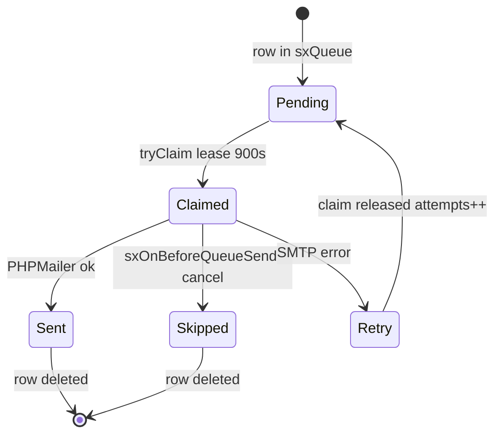

# Email queue

The **Email queue** tab in **Components → Sendex** builds and sends letters to subscribers.

## Building the queue

1. Open **Components → Sendex**
2. On **Email queue** select a newsletter in the dropdown and click **Add to queue**


Each subscriber gets an `sxQueue` row with a snapshot of mail headers. The body is rendered **at send time** from the newsletter template (compact mode: empty `email_body` in the queue).

Duplicates are skipped by row hash.

Events: `sxOnBeforeAddQueues` (cancellable) and `sxOnAddQueues`.

## Manual send


| Action | Description |
| --- | --- |
| **Send** | Send selected rows |
| **Send all** | Send the entire queue |
| **Remove / Remove all** | Drop queue rows without sending |

Manual send from the manager stops on the first error (`stopOnError: true`).

### Single message pipeline

1. Atomic claim: row gets `claimed_at`, `attempts++`, `expires_at` (+900 sec)
2. Render body from template with `newsletter`, `subscriber`, `user`, `profile` placeholders
3. Event `sxOnBeforeQueueSend` — plugin can cancel (row removed, no requeue)
4. Send via PHPMailer
5. Success — row deleted, event `sxOnQueueSend`
6. Failure — claim released, event `sxOnQueueSendFailed`, retry on next run

After a batch — event `sxOnQueueFlushComplete`.

### Claim and retry



| Result | Queue row | Event |
| --- | --- | --- |
| Success | deleted | `sxOnQueueSend` |
| BeforeQueueSend cancel | deleted | — |
| SMTP error | claim released, retry | `sxOnQueueSendFailed` |
| Plugin skip (`false`) | deleted | — |

Parallel cron workers cannot send the same row twice — atomic DB claim.

## Cron {#cron}

Add a cron job from the MODX site root:

```bash
php core/components/sendex/cron/send.php
```

Frequency depends on subscriber count and hosting limits. Default batch size: **100** emails per run.

Change the limit with system setting `sendex_queue_limit` — transport **does not create** this key; add it manually if needed. See [System settings](../settings#settings-not-in-transport).

Example cron entry (every minute):

```bash
* * * * * php /path/to/modx/core/components/sendex/cron/send.php
```

Cron uses the same pipeline as **Send all**, but **does not stop** on the first error and logs failures to the MODX log.

## Manager send vs cron

| | Manager “Send to subscribers” | Queue + cron |
| --- | --- | --- |
| Build queue | yes | manual or **Add to queue** |
| Send | immediately | on schedule |
| Stop on error | yes | no |
| Batch limit | all queue rows | `sendex_queue_limit` (100) |

## Related

- [Subscriptions](subscriptions) — create newsletter and **Send to subscribers**
- [Events](../integration/events) — queue hooks
- [System settings](../settings) — `sendex_queue_limit`
