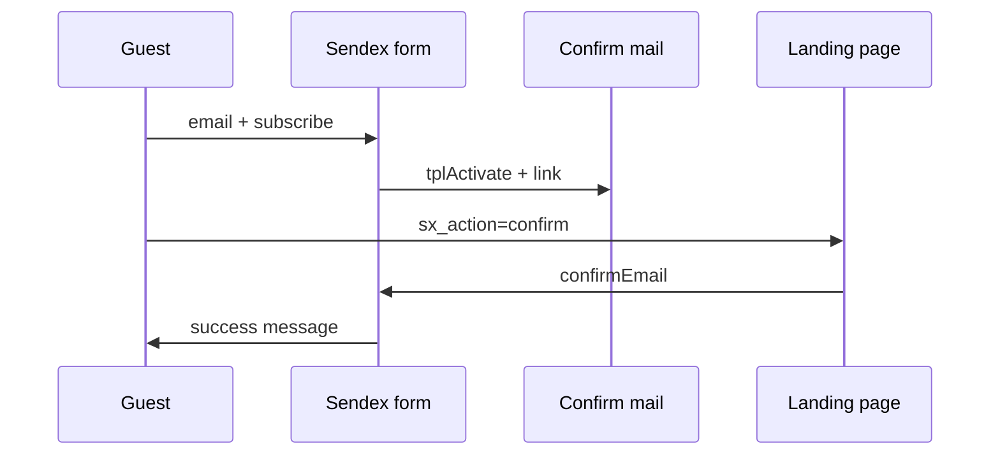

# Sendex

The snippet renders a subscribe or unsubscribe form and handles user actions.

Call it **uncached** — output depends on login state.

::: code-group

```fenom
{'!Sendex' | snippet : ['id' => 1]}
```

```modx
[[!Sendex? &id=`1`]]
```

:::

## Parameters

| Parameter | Default | Description |
| --- | --- | --- |
| `&id` | — | Newsletter ID (`sxNewsletter`) |
| `&showInactive` | `0` | Show form for a disabled newsletter |
| `&msgClass` | `active` | CSS class for `[[+class]]` when `[[+message]]` is set |
| `&tplSubscribeAuth` | `tpl.Sendex.subscribe.auth` | Chunk for logged-in users |
| `&tplSubscribeGuest` | `tpl.Sendex.subscribe.guest` | Chunk for guests |
| `&tplUnsubscribe` | `tpl.Sendex.unsubscribe` | Unsubscribe chunk |
| `&tplActivate` | `tpl.Sendex.activate` | Email confirmation chunk |

## Additional parameters (code only)

These work when passed in the call but **do not appear** in MODX snippet properties UI:

| Parameter | Default | Description |
| --- | --- | --- |
| `&confirmEmail` | `sendex_confirm_email` (`1`) | Guests must confirm by email |
| `&confirmRateLimit` | `sendex_confirm_rate_limit` (`0`) | Interval between confirmation emails (sec) |
| `&csrfProtect` | `sendex_csrf_protect` (`0`) | CSRF for POST subscribe/unsubscribe |
| `&loadJs` | `1` | Load `assets/components/sendex/js/web/sendex.js` |
| `&widgetKey` | *(empty)* | Widget key when several forms share one page |

## Form chunk placeholders

| Placeholder | MODX | Fenom |
| --- | --- | --- |
| Newsletter ID | `[[+id]]` | `{$id}` |
| Name | `[[+name]]` | `{$name}` |
| Description | `[[+description]]` | `{$description}` |
| Message | `[[+message]]` | `{$message}` |
| CSS class | `[[+class]]` | `{$class}` |
| Error flag | `[[+error]]` | `{$error}` |
| Widget key | `[[+widget_key]]` | `{$widget_key}` |
| CSRF token | `[[+csrf_token]]` | `{$csrf_token}` |
| Subscriber code | `[[+code]]` | `{$code}` |

For logged-in users the chunk also receives `modUser` and Profile fields (`[[+username]]` / `{$username}`, `[[+email]]` / `{$email}`, etc.).

## Subscription flows

### Logged-in user

One click → `subscribe(userId)`. Email comes from Profile. If a guest row with the same email exists — `user_id` is attached.

### Guest with confirmation (default)

1. POST `sx_action=subscribe` + `email`
2. Sendex stores a hash in modDbRegister (`/sendex/subscribe/`, TTL 30 min)
3. Sends mail with chunk `tplActivate` and link `sx_action=confirm&hash=...&newsletter_id=...`
4. Link hit → `confirmEmail()` → subscription with `source=confirm`

### Guest without confirmation

::: code-group

```fenom
{'!Sendex' | snippet : ['id' => 1, 'confirmEmail' => 0]}
```

```modx
[[!Sendex? &id=`1` &confirmEmail=`0`]]
```

:::

Or system setting `sendex_confirm_email=No` → subscription with `source=guest`.

### Confirm link from email

Landing page query parameters:

| Parameter | Value |
| --- | --- |
| `sx_action` | `confirm` |
| `hash` | hash from modDbRegister |
| `newsletter_id` | newsletter ID |

The snippet on the page handles them automatically; no separate call needed.



## Unsubscribe

### On the site

Logged-in subscribers see an unsubscribe form. POST `sx_action=unsubscribe` with subscriber `code`.

### From email link

The page must call the Sendex snippet:

::: code-group

```fenom
{'!Sendex' | snippet : ['id' => 1]}
```

```modx
[[!Sendex? &id=`1`]]
```

:::

Query parameters:

| Parameter | Required | Description |
| --- | --- | --- |
| `sx_action` | yes | `unsubscribe` |
| `code` | yes | `sxSubscriber.code` |
| `newsletter_id` | no | Newsletter ID; snippet resolves by `code` if `&id` differs |

Confirm/unsubscribe links **omit** `sendex_widget_key`. Keep one snippet without `&widgetKey` on the landing page.

## AJAX

By default the snippet loads `sendex.js`. Forms with `data-sendex-widget`, `data-sendex-form`, `data-sendex-message` submit via `fetch` without reload.

Server response:

```json
{"success": true, "message": "...", "html": "..."}
```

AJAX is detected via `X-Requested-With: XMLHttpRequest`, `ajax=1`, or `sendex_ajax=1`.

Disable JS:

::: code-group

```fenom
{'!Sendex' | snippet : ['id' => 1, 'loadJs' => 0]}
```

```modx
[[!Sendex? &id=`1` &loadJs=`0`]]
```

:::

Forms use normal POST with redirect.

### Multiple forms on one page

Give each call a unique `widgetKey` and pass it in hidden `sendex_widget_key`. Only the matching snippet instance handles the POST.

::: code-group

```fenom
{'!Sendex' | snippet : ['id' => 1, 'widgetKey' => 'footer']}
{'!Sendex' | snippet : ['id' => 2, 'widgetKey' => 'sidebar']}
```

```modx
[[!Sendex? &id=`1` &widgetKey=`footer`]]
[[!Sendex? &id=`2` &widgetKey=`sidebar`]]
```

:::

## Letter template {#letter-template}

On queue send the newsletter MODX template receives:

| Object | MODX | Fenom |
| --- | --- | --- |
| `newsletter` | `[[+newsletter.id]]`, `[[+newsletter.name]]`, … | `{$newsletter.id}`, `{$newsletter.name}`, … |
| `subscriber` | `[[+subscriber.email]]`, `[[+subscriber.code]]`, … | `{$subscriber.email}`, `{$subscriber.code}`, … |
| `user` | `[[+user.id]]`, `[[+user.username]]`, … | `{$user.id}`, `{$user.username}`, … |
| `profile` | `[[+profile.fullname]]`, `[[+profile.email]]`, … | `{$profile.fullname}`, `{$profile.email}`, … |

Unsubscribe link:

::: code-group

```fenom
{set $args = [
  'sx_action' => 'unsubscribe',
  'newsletter_id' => $newsletter.id,
  'code' => $subscriber.code,
]}
<a href="{'site_start' | option | url : ['scheme' => 'full'] : $args}">Unsubscribe</a>
```

```modx
<a href="[[~[[++site_start]]?scheme=`full`&sx_action=`unsubscribe`&newsletter_id=`[[+newsletter.id]]`&code=`[[+subscriber.code]]`]]">
  Unsubscribe
</a>
```

:::

### Custom guest form chunk

::: code-group

```fenom
<div class="sendex-widget" data-sendex-widget>
  <p class="sendex-message {$class}" data-sendex-message><b>{$message}</b></p>
  <form action="" method="post" data-sendex-form>
    <input type="hidden" name="sx_action" value="subscribe">
    <input type="hidden" name="newsletter_id" value="{$id}">
    {if $widget_key}
      <input type="hidden" name="sendex_widget_key" value="{$widget_key}">
    {/if}
    {if $csrf_token}
      <input type="hidden" name="sendex_csrf" value="{$csrf_token}">
    {/if}
    <input type="email" name="email" required>
    <button type="submit">Subscribe</button>
  </form>
</div>
```

```modx
<div class="sendex-widget" data-sendex-widget>
  <p class="sendex-message [[+class]]" data-sendex-message><b>[[+message]]</b></p>
  <form action="" method="post" data-sendex-form>
    <input type="hidden" name="sx_action" value="subscribe">
    <input type="hidden" name="newsletter_id" value="[[+id]]">
    [[+widget_key:notempty=`<input type="hidden" name="sendex_widget_key" value="[[+widget_key]]">`]]
    [[+csrf_token:notempty=`<input type="hidden" name="sendex_csrf" value="[[+csrf_token]]">`]]
    <input type="email" name="email" required>
    <button type="submit">Subscribe</button>
  </form>
</div>
```

:::

## Default chunks

| Chunk | Purpose |
| --- | --- |
| `tpl.Sendex.subscribe.auth` | Form for logged-in users |
| `tpl.Sendex.subscribe.guest` | Guest form (email + hidden fields) |
| `tpl.Sendex.unsubscribe` | Unsubscribe form |
| `tpl.Sendex.activate` | Confirmation email body (`[[+link]]`, `[[+email_body]]`) |

### Auth subscribe form

::: code-group

```fenom
<div class="sendex-widget" data-sendex-widget>
  <p class="sendex-message {$class}" data-sendex-message><b>{$message}</b></p>
  <form action="" method="post" data-sendex-form>
    <input type="hidden" name="sx_action" value="subscribe">
    <input type="hidden" name="newsletter_id" value="{$id}">
    <button type="submit">Subscribe</button>
  </form>
</div>
```

```modx
<div class="sendex-widget" data-sendex-widget>
  <p class="sendex-message [[+class]]" data-sendex-message><b>[[+message]]</b></p>
  <form action="" method="post" data-sendex-form>
    <input type="hidden" name="sx_action" value="subscribe">
    <input type="hidden" name="newsletter_id" value="[[+id]]">
    <button type="submit">Subscribe</button>
  </form>
</div>
```

:::

### Unsubscribe form

::: code-group

```fenom
<div class="sendex-widget" data-sendex-widget>
  <form action="" method="post" data-sendex-form>
    <input type="hidden" name="sx_action" value="unsubscribe">
    <input type="hidden" name="newsletter_id" value="{$id}">
    <input type="hidden" name="code" value="{$code}">
    <button type="submit">Unsubscribe</button>
  </form>
</div>
```

```modx
<div class="sendex-widget" data-sendex-widget>
  <form action="" method="post" data-sendex-form>
    <input type="hidden" name="sx_action" value="unsubscribe">
    <input type="hidden" name="newsletter_id" value="[[+id]]">
    <input type="hidden" name="code" value="[[+code]]">
    <button type="submit">Unsubscribe</button>
  </form>
</div>
```

:::

### Confirmation email (tplActivate)

::: code-group

```fenom
<p>Confirm your subscription:</p>
<p><a href="{$link}">{$link}</a></p>
```

```modx
<p>Confirm your subscription:</p>
<p><a href="[[+link]]">[[+link]]</a></p>
```

:::

### Multiple forms and confirm/unsubscribe landing

Two newsletters on one page — each needs its own `widgetKey`. A separate landing page **without** `widgetKey` handles mail links:

::: code-group

```fenom
{'!Sendex' | snippet : ['id' => 1, 'widgetKey' => 'promo']}
{'!Sendex' | snippet : ['id' => 2, 'widgetKey' => 'news']}

{# landing /confirm — no widgetKey #}
{'!Sendex' | snippet : ['id' => 1]}
```

```modx
[[!Sendex? &id=`1` &widgetKey=`promo`]]
[[!Sendex? &id=`2` &widgetKey=`news`]]

[[!Sendex? &id=`1`]]
```

:::

## More parameter examples

### Inactive newsletter on preview page

::: code-group

```fenom
{'!Sendex' | snippet : ['id' => 1, 'showInactive' => 1]}
```

```modx
[[!Sendex? &id=`1` &showInactive=`1`]]
```

:::

### Custom message CSS class

::: code-group

```fenom
{'!Sendex' | snippet : ['id' => 1, 'msgClass' => 'alert-success']}
```

```modx
[[!Sendex? &id=`1` &msgClass=`alert-success`]]
```

:::

## Guest → user merge

The Sendex plugin on `OnUserActivate` and `OnUserSave` attaches guest rows with the same email to the new `modUser`. Merge does **not** run on `OnBeforeUserActivate`.

## Related

- [System settings](../settings) — `sendex_confirm_email`, CSRF, rate limit
- [Events](../integration/events) — `sxOnSubscribe`, `sxOnUnsubscribe`
- [FAQ](../faq) — common issues
- [PHP API](../integration/api) — call from code
