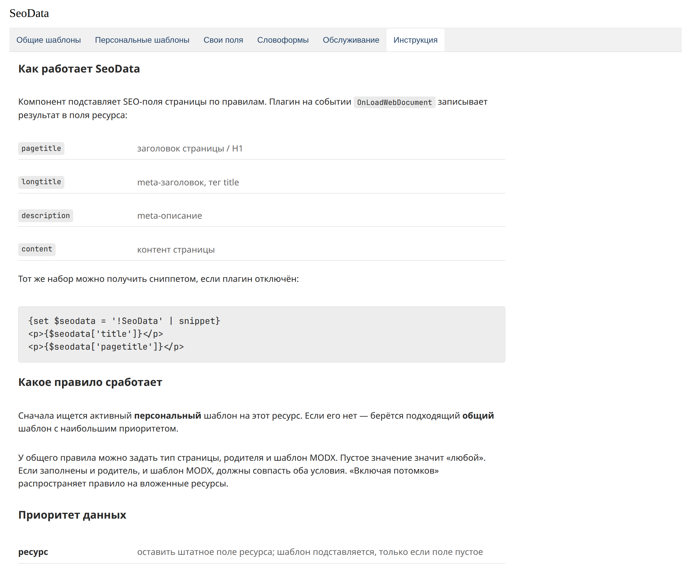

# SeoData

SeoData fills a page's SEO fields from Fenom templates. One rule sets the heading, meta title, description, and content for a MODX document, a MiniShop3 product, or a MiniShop3 category.

| Rule field | Where it goes |
| --- | --- |
| Page heading template | `pagetitle`, the H1 tag |
| Meta title template | `longtitle`, the `<title>` tag |
| Meta description template | `description` |
| Content template | `content` |

Example for a “Yachts” category:

```fenom
{$pagetitle} купить в «{$site_name}»{if $page?} {$page}{/if}
```

```fenom
Купить {$pagetitle.acc|lc} в «{$site_name}» от {$price.min} ₽. В наличии {$count} наименований.
```

On the storefront this produces a title like `Яхты купить в «Название_компании» | Страница 2` and a description with the price and the number of products.

The plugin on `OnLoadWebDocument` writes the result into the resource. The `SeoData` snippet returns the same fields when the plugin is turned off.

The component continues [mvtSeoData](https://modstore.pro/packages/other/mvtseodata) for MODX 3: shared rules by parent and MODX template, MiniShop3 fields and TVs, and a word-form dictionary. The manager is built on [VueTools](/en/components/vuetools/) with the `modx` theme.

## Panel

The menu item is **Extras → SeoData**.



Six tabs:

1. **Common templates** — rules by page type, parent, and MODX template.
2. **Personal templates** — one active rule per resource.
3. **Custom fields** — MiniShop3 columns, options, and TVs that become placeholders.
4. **Word forms** — grammatical cases for templates.
5. **Maintenance** — the price and product-count index for categories.
6. **Instruction** — this same guide inside the panel.
