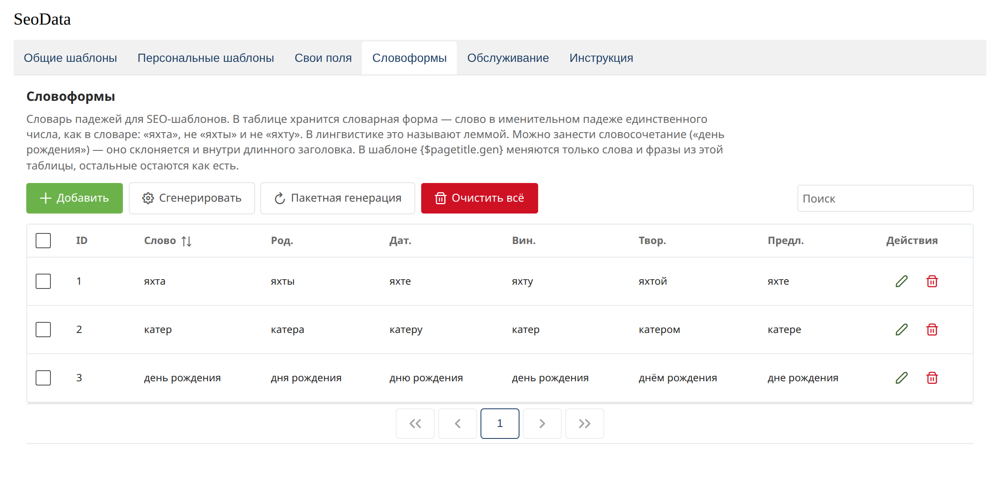
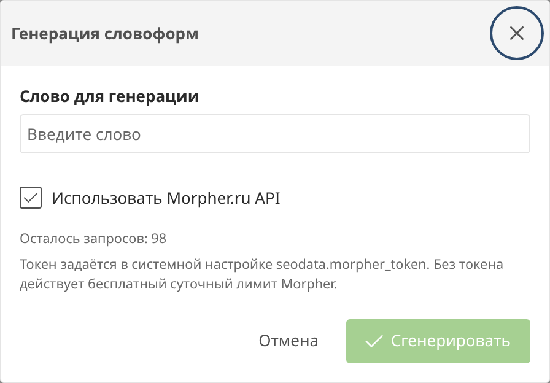

# Word forms

The **Word forms** tab is a case dictionary. Only words and phrases stored in the table are inflected in a template. The rest of the text stays as it is.

The **dictionary form** is the word in the nominative singular, as in a dictionary: `яхта`, not `яхты` and not `яхту`. A phrase is stored as one row, for example `день рождения`.

## Cases in a template

Suffixes work on `{$pagetitle}`, `{$parent.pagetitle}`, `{$menutitle}`, `{$site_name}`, `{$vendor.name}`, and custom string fields.

| Notation | Case | For «яхта» |
| --- | --- | --- |
| `{$pagetitle}` | nominative | яхта |
| `{$pagetitle.gen}` | genitive | яхты |
| `{$pagetitle.dat}` | dative | яхте |
| `{$pagetitle.acc}` | accusative | яхту |
| `{$pagetitle.ins}` | instrumental | яхтой |
| `{$pagetitle.pre}` | prepositional, without a preposition | яхте |

The original capitalization is kept: `Яхта` becomes `Яхты`.

The dictionary contains `яхта` and `катер`, and the page title is `Аренда яхты и катера в Сочи`:

| Template | Result |
| --- | --- |
| `{$pagetitle}` | Аренда яхты и катера в Сочи |
| `{$pagetitle.dat}` | Аренда яхте и катеру в Сочи |

`Сочи` is not in the dictionary, so the city is not inflected.

If the dictionary has both a short word and a longer phrase, the longest match on word boundaries wins. `День рождения на теплоходе` and `{$pagetitle.gen|lc}` produce `дня рождения на теплоходе` when the dictionary contains `день рождения`.

The plural (`{$color.pl}`, `{$color.pl.gen}`) is substituted only when the whole string matches a dictionary form. On a long title, `{$pagetitle.pl}` stays singular.

## Word card

The singular is on the left, the plural on the right. Each case shows its Fenom modifier. The question mark shows the case question.

## Generation through Morpher

The **Generate** and **Batch generation** buttons call [Morpher.ru](https://www.morpher.ru/ws3/) only from the manager. The storefront reads the table and does not call the API.

The token is the `seodata.morpher_token` setting. Without a token, Morpher's free daily limit applies.

Batch generation fills empty cases for the selected rows or for the whole table. The “Only rows without a genitive case” checkbox skips rows that are already filled.

The **Clear all** button deletes the dictionary. Templates with `{$pagetitle.gen}` then output the original text again.
