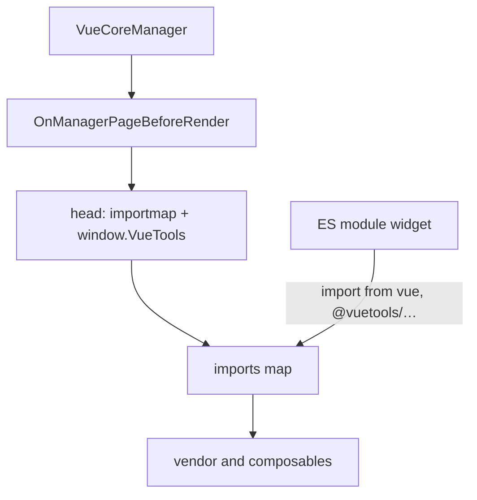

# VueTools

Vue, Pinia, and PrimeVue load once through the Import Map. Extras do not bundle their own copies.

## What it solves

Without a shared package, every Extra ships separate copies of Vue, Pinia, and PrimeVue.

- One library version across all components.
- Libraries load once and stay in the browser cache.
- PrimeIcons isolated with the `.vueApp` prefix (see below).
- Ready composables: `useLexicon`, `useApi`, `useModx`, `usePermission`, `usePrimeVueLocale`, `useTheme`.
- Theme from the `vuetools.theme` system setting (since 1.2.0).

## What's inside

| Library | Version | Purpose |
|---------|---------|---------|
| Vue 3 | 3.5.x | Reactive framework |
| Pinia | 3.0.x | State management |
| PrimeVue | 4.5.x | UI components, `Aura` and `Modx` themes |
| PrimeIcons | 7.0.x | Icons |

| Composable | Purpose |
|--------|---------|
| `useLexicon` | MODX lexicons |
| `useApi` | HTTP client for the standard MODX connector API |
| `useModx` | Access to `window.MODx` |
| `usePermission` | User permission checks |
| `usePrimeVueLocale` | PrimeVue locales for DataTable and DatePicker |
| `useTheme` | Active theme from the `vuetools.theme` setting |

## Requirements

| Requirement | Version |
|-------------|---------|
| MODX Revolution | 3.0.0+ |
| PHP | 8.1+ |
| Browser | ES Modules (Chrome 89+, Firefox 108+, Safari 16.4+, Edge 89+) |

## Installation

1. Open **Extras → Installer**.
2. Click **Download Extras**.
3. Find **VueTools**, click **Download**, then **Install**.

After install, VueTools injects the Import Map, styles, and client theme config on manager pages.

## How the Import Map works



The `VueCoreManager` plugin on `OnManagerPageBeforeRender` inserts one block: Import Map and `window.VueTools` script. Usually at the start of the controller `<head>`. If `controller->head['html']` is unavailable, HTML goes to `sjscripts`.

Base URL: `MODX_ASSETS_URL` or `vuetools.assets_url`. Files get `?v=` (mtime or package version) so updates do not serve stale cache.

Example map (paths and `?v=` are illustrative):

```json
{
  "imports": {
    "vue": "/assets/components/vuetools/vendor/vue.min.js?v=…",
    "pinia": "/assets/components/vuetools/vendor/pinia.min.js?v=…",
    "primevue": "/assets/components/vuetools/vendor/primevue.min.js?v=…",
    "vuetools": "/assets/components/vuetools/vendor/primevue.min.js?v=…",
    "vuetools/theme": "/assets/components/vuetools/vendor/primevue.min.js?v=…",
    "@vuetools/useApi": "/assets/components/vuetools/composables/useApi.min.js?v=…",
    "@vuetools/useLexicon": "/assets/components/vuetools/composables/useLexicon.min.js?v=…",
    "@vuetools/useModx": "/assets/components/vuetools/composables/useModx.min.js?v=…",
    "@vuetools/usePermission": "/assets/components/vuetools/composables/usePermission.min.js?v=…",
    "@vuetools/usePrimeVueLocale": "/assets/components/vuetools/composables/usePrimeVueLocale.min.js?v=…",
    "@vuetools/useTheme": "/assets/components/vuetools/composables/useTheme.min.js?v=…",
    "@vuetools/": "/assets/components/vuetools/composables/"
  }
}
```

`import { ref } from 'vue'` resolves through this map.

Keys `vuetools` and `vuetools/theme` point to the same build as `primevue`. Theme presets (`Modx`, `ModxManagerTheme`, `ModxTheme`) import from them. Key `vuetools/theme` also marks VueTools 1.2.0+ (see [Theme](theme)).

The `@vuetools/` prefix maps to the composables directory. There is no `@vuetools` key without a slash: do not use it as a public entry.

### `window.VueTools`

The second tag in the same block writes:

```javascript
window.VueTools = Object.assign({}, window.VueTools || {}, { theme: 'aura' })
```

Only `theme` is on the object (value from `vuetools.theme`). Package and library versions are not exposed here. See [PHP service](integration#php-service).

## Style isolation

In `vuetools.css`, **PrimeIcons** selectors (`.pi`) are wrapped with `.vueApp`. The widget container needs class `vueApp` or icons will not show:

```html
<div id="my-vue-app" class="vueApp"></div>
```

PrimeVue 4 component styles do not depend on `.vueApp`. The class is for icons only, not ExtJS isolation.

::: warning
Without `vueApp`, PrimeIcons (`.pi`) styles will not apply to the widget.
:::

::: info Former name
The package was previously called **ModxProVueCore** and was renamed to **VueTools**.
:::

## Next

- [Quick Start](quick-start): from install to a widget on a tab.
- [Integration](integration): Vite, controller, PHP service.
- [Theme](theme): switch and presets.
- [API Composables](composables): function reference.
- [Practices and CRUD](practices): Extra layout and list → form → toast.

## Support

GitHub Issues: [modx-pro/vuetools](https://github.com/modx-pro/vuetools/issues)
