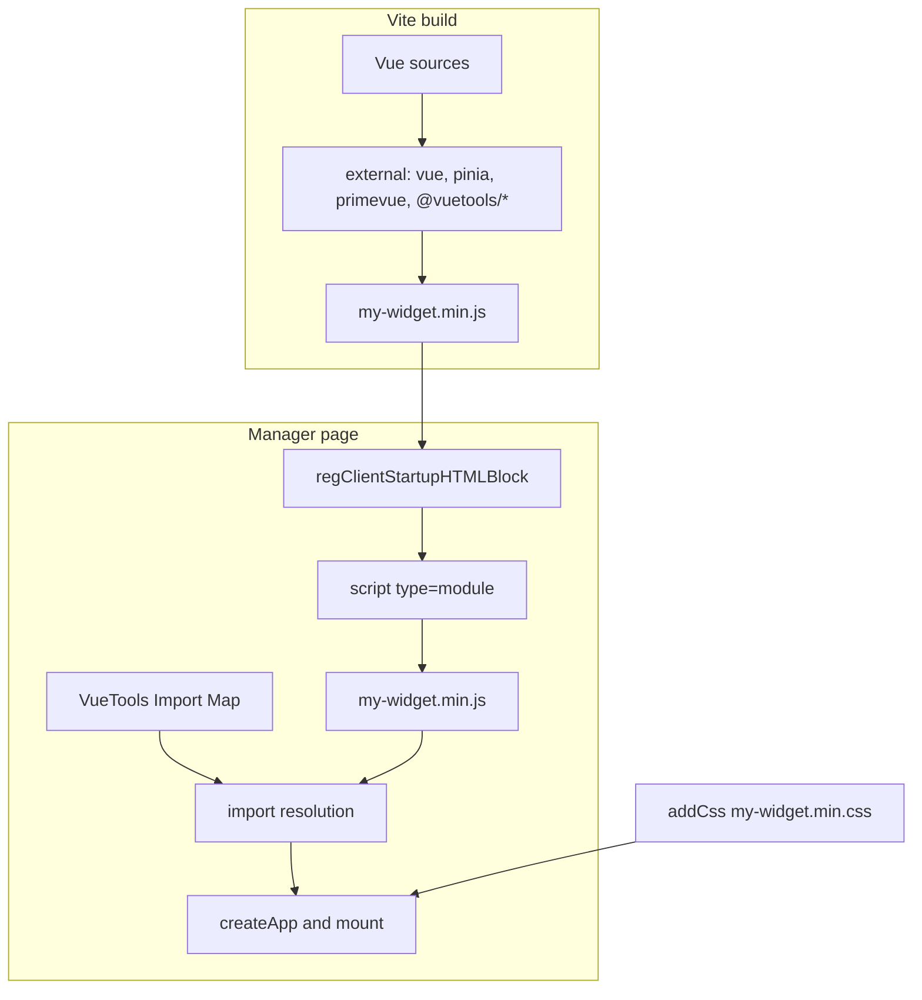

# Integration

Build the widget as an ES module: keep runtime (`vue`, `pinia`, `primevue`, `@vuetools/*`) outside the bundle and load the script via `regClientStartupHTMLBlock`.

## Vite setup

In `vite.config.js` list external dependencies. VueTools serves them through the Import Map:

```javascript
import { defineConfig } from 'vite'
import vue from '@vitejs/plugin-vue'
import prefixSelector from 'postcss-prefix-selector'

export default defineConfig({
  plugins: [vue()],
  build: {
    rollupOptions: {
      external: [
        'vue',
        'pinia',
        'primevue',
        'vuetools',
        'vuetools/theme',
        '@vuetools/useTheme',
        '@vuetools/useApi',
        '@vuetools/useLexicon',
        '@vuetools/useModx',
        '@vuetools/usePermission',
        '@vuetools/usePrimeVueLocale'
      ],
      output: { format: 'es', entryFileNames: '[name].min.js' }
    }
  },
  css: {
    postcss: {
      plugins: [prefixSelector({ prefix: '.vueApp', exclude: [/^:root/, /^\.p-/, /^\.pi/, /^\[data-p-/] })]
    }
  }
})
```

Import PrimeVue only from `primevue`; presets from `vuetools` or `vuetools/theme`. No subpath in the Import Map: `primevue/button` does not resolve in the manager. If Vite inlines a subpath into the Extra bundle, you get a second PrimeVue instance without the VueTools theme.

## Module loading in the controller



Load ES modules via `regClientStartupHTMLBlock` (after the Import Map). One call per `<script>` tag.

```php
class MyComponentManagerController extends modExtraManagerController
{
    public function loadCustomCssJs()
    {
        $assetsUrl = $this->myComponent->config['assetsUrl'];

        $this->addCss($assetsUrl . 'css/mgr/vue-dist/my-widget.min.css');
        $this->modx->regClientStartupHTMLBlock(
            '<script type="module" src="' . $assetsUrl . 'js/mgr/vue-dist/my-widget.min.js"></script>'
        );
    }
}
```

::: danger
`addJavascript()` and `addLastJavascript()` do not set `type="module"`. Several tags in one multiline string are split incorrectly by MODX: register each with its own call.
:::

## VueTools presence check {#vuetools-check}

Without VueTools the console shows `Failed to resolve module specifier "vue"` and the container stays empty.

```php
protected static $vueCoreCheckRegistered = false;

public function addVueModule(string $src): void
{
    if (!self::$vueCoreCheckRegistered) {
        $this->registerVueCoreCheck();
        self::$vueCoreCheckRegistered = true;
    }
    $this->modx->regClientStartupHTMLBlock(
        '<script type="module" data-vue-module src="' . $src . '"></script>'
    );
}

protected function registerVueCoreCheck(): void
{
    $message = $this->modx->lexicon('mycomponent_vuetools_required')
        ?: 'VueTools package is required. Install it from Package Manager.';

    $script = <<<JS
<script>
(function () {
    var map = document.querySelector('script[type="importmap"]');
    var ok = false;
    if (map) {
        try {
            var imports = JSON.parse(map.textContent).imports;
            ok = imports && imports.vue;
        } catch (e) { ok = false; }
    }
    if (!ok) {
        document.querySelectorAll('script[type="module"][data-vue-module]').forEach(function (el) { el.remove(); });
        if (typeof MODx !== 'undefined' && MODx.msg) { MODx.msg.alert('', '{$message}'); }
        window.MY_COMPONENT_VUE_CORE_MISSING = true;
    }
})();
</script>
JS;
    $this->modx->regClientStartupHTMLBlock($script);
}
```

Attribute `data-vue-module` removes modules from the page when VueTools is missing. For theme via `getActiveTheme()` also check `vuetools/theme`. See [Theme](theme#version).

```php
$this->addVueModule($assetsUrl . 'js/mgr/vue-dist/my-widget.min.js');
```

```php
$_lang['mycomponent_vuetools_required'] = 'VueTools package is required. Install it from Package Manager.';
```

## PHP service {#php-service}

Do not `new \VueTools\Service` in an Extra. Get the service from the MODX container:

```php
/** @var \VueTools\Service $vueTools */
$vueTools = $modx->services->get('vuetools');
// alias for the same object:
// $modx->services->get('vueTools');
```

Container keys `vuetools` and `vueTools` point to **one** instance (otherwise Import Map and styles register twice).

Methods (`VueTools\VueCore` / `Service`):

| Method | Purpose |
|-------|------------|
| `include()` | Import Map + CSS + theme setting combo (`includeManagerCombos`) |
| `registerImportMap()` | Import Map and `window.VueTools.theme` only |
| `includeStyles()` | `vuetools.css` |
| `includeManagerCombos()` | ExtJS combo for `vuetools.theme` setting |
| `isRegistered()` | Instance flag: Import Map already registered. Does not inspect DOM |
| `isStylesIncluded()` | Instance flag: styles already included. Does not inspect DOM |
| `getVersion()` | Package version, e.g. `1.2.1-pl` |
| `getVersions()` | Library versions array (`vue`, `pinia`, `primevue`, `primeicons`) |
| `getAssetsUrl()` | VueTools assets URL |

Transport dependency signature: **`vuetools`** (not the old name `modxpro-vue-core`).

### Public contract

| Public | Not contract |
|----------|-------------|
| Import Map keys: `vue`, `pinia`, `primevue`, `vuetools`, `vuetools/theme`, `@vuetools/*` | VueTools package `src/` |
| Six `@vuetools/*` composables, presets `Modx`, `ModxManagerTheme`, `ModxTheme` | Internal PHP flags outside the method table |
| `$modx->services->get('vuetools')`, methods in the table above | Theme registry in `useTheme.js` (not extensible from outside) |
| `window.VueTools.theme`, `vuetools.theme` setting, `vuetools.assets_url` option | Default export from `primevue` / `pinia` (named import only) |

Option `vuetools.assets_url` is read via `getOption` when set manually. It is not in transport as a system setting. Usually `MODX_ASSETS_URL` is enough.

## Using in a component

```vue
<script setup>
import { ref, computed } from 'vue'
import { Button, DataTable, Column } from 'primevue'
import { useLexicon } from '@vuetools/useLexicon'
import { usePermission } from '@vuetools/usePermission'

const { _ } = useLexicon()
const { can } = usePermission()

const items = ref([])
const canEdit = computed(() => can('my_component_edit'))
</script>

<template>
  <div class="my-component">
    <Button v-if="canEdit" :label="_('my_component_add')" />
    <DataTable :value="items">
      <Column field="name" :header="_('my_component_name')" />
    </DataTable>
  </div>
</template>
```

## Entry point

```javascript
import { createApp } from 'vue'
import { createPinia } from 'pinia'
import { PrimeVue, ToastService } from 'primevue'
import { getActiveTheme } from '@vuetools/useTheme'
import MyWidget from '../components/MyWidget.vue'

let app = null

export function init(selector = '#my-vue-widget') {
  const el = document.querySelector(selector)
  if (!el || el.dataset.vApp === 'true') return app

  app = createApp(MyWidget)
  app.use(createPinia())
  app.use(PrimeVue, getActiveTheme())
  app.use(ToastService)
  app.mount(selector)
  el.dataset.vApp = 'true'
  return app
}

window.MyComponentWidget = { init }
```

`dataset.vApp` prevents remount when the tab activates again.

## ExtJS tab

Container with `vueApp` class; init on tab activation:

```javascript
{
  title: _('my_tab_title'),
  html: '<div id="my-vue-widget" class="vueApp"></div>',
  listeners: {
    activate: function () {
      if (window.MyComponentWidget) {
        window.MyComponentWidget.init('#my-vue-widget')
      }
    }
  }
}
```

::: warning
Without `vueApp`, PrimeIcons (`.pi`) will not apply. PrimeVue component styles do not depend on this class.
:::

## Custom API client {#own-api-client}

`useApi` works with the standard connector. Custom router: local `request.js`:

```javascript
class Request {
  buildUrl(route, params = {}) {
    const url = new URL(window.myComponent.config.connector_url, window.location.origin)
    url.searchParams.set('action', 'MyComponent\\Processors\\Api\\Index')
    url.searchParams.set('route', route)
    const token = window.MODx?.siteId
    if (token) url.searchParams.set('HTTP_MODAUTH', token)
    Object.entries(params).forEach(([k, v]) => { if (v != null) url.searchParams.set(k, v) })
    return url.toString()
  }

  async request(method, route, data = null) {
    const options = { method, headers: { Accept: 'application/json' }, credentials: 'same-origin' }
    let url = this.buildUrl(route, method === 'GET' ? data : {})
    if (method !== 'GET' && data) {
      options.headers['Content-Type'] = 'application/json'
      options.body = JSON.stringify(data)
    }
    const result = await (await fetch(url, options)).json()
    if (!result.success) throw new Error(result.message || 'Request failed')
    return result.object || result.data || result
  }

  get(route, params) { return this.request('GET', route, params) }
  post(route, data) { return this.request('POST', route, data) }
}

export default new Request()
```

Unpacking `object || data` exists only in **this** sample, not in `useApi`.

## Checklist

- [ ] `external` in Vite: `vue`, `pinia`, `primevue`, optionally `vuetools` / `vuetools/theme`, used `@vuetools/*`.
- [ ] PrimeVue without subpath imports.
- [ ] Theme via `getActiveTheme()`, not a hardcoded preset (if you need the switcher).
- [ ] `addVueModule()` with dependency check.
- [ ] Error message lexicon in both languages.
- [ ] `class="vueApp"` on containers (for icons).
- [ ] Lexicon topics in the controller.
- [ ] Local `request.js` if custom router.
- [ ] Package dependency: signature `vuetools`.

## Example

[MiniShop3](https://github.com/modx-pro/MiniShop3): integration with a custom router.
