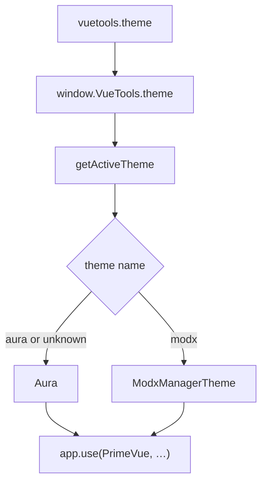

# Theme

System setting `vuetools.theme` sets the PrimeVue theme for every component that calls `getActiveTheme()`. Since 1.2.0.

## Switch the theme

**System → System Settings → `vuetools.theme`**.



| Value | Theme |
|-------|-------|
| `aura` | `Aura`: standard PrimeVue theme (default) |
| `modx` | `ModxManagerTheme`: MODX Revolution 3 manager look (no dark mode) |

After changing the setting, widgets with `getActiveTheme()` pick up the theme without rebuild. Name: `trim` and lowercase (` MODX ` → `modx`). Empty or unknown → `aura`. Registry has only `aura` and `modx`; you cannot register a custom theme in the package.

`getActiveTheme()` returns a reference to the registry entry. Do not mutate `theme.options`: changes affect every later call on the page ([issue #66](https://github.com/modx-pro/vueTools/issues/66)).

## Apply in a component

```javascript
import { PrimeVue } from 'primevue'
import { getActiveTheme } from '@vuetools/useTheme'

app.use(PrimeVue, getActiveTheme())
```

With locale:

```javascript
import { getPrimeVueLocale } from '@vuetools/usePrimeVueLocale'

app.use(PrimeVue, { ...getActiveTheme(), locale: getPrimeVueLocale() })
```

`getActiveTheme()` reads `window.VueTools.theme` and returns `{ theme }` for the active registry entry.

Hardcoded preset in code (`{ theme: { preset: Aura } }`) ignores `vuetools.theme`. `useTheme({ name })` equals `getActiveTheme(name)` and returns `{ theme }`.

## Presets `Modx`, `ModxManagerTheme`, `ModxTheme`

Import from `primevue`, `vuetools`, or `vuetools/theme` (same build):

| Export | Purpose |
|---------|------------|
| `Modx` | Nora-based preset: square controls, manager density. Field 32px (`2rem`), button 36px (`2.25rem`). Button without severity and `severity="success"`: green `#6CB24A`. Navy `#234368` is not button fill |
| `ModxManagerTheme` | `{ preset: Modx, options: { darkModeSelector: 'none', cssLayer: false } }`. Manager without dark mode. What `getActiveTheme()` returns when `vuetools.theme = modx` |
| `ModxTheme` | `{ preset: Modx, options: { darkModeSelector: '.p-dark', cssLayer: false } }`. Standalone / storefront: dark mode via `p-dark` on an ancestor |

```javascript
import { Modx, ModxManagerTheme, ModxTheme } from 'vuetools/theme'
```

## Version requirement {#version}

`getActiveTheme()` and `@vuetools/useTheme` appeared in VueTools 1.2.0. On an older package the key is missing from the Import Map and the module fails on import.

Theme-capable version marker: `vuetools/theme` in the Import Map. Extend the dependency check (see [Integration](integration#vuetools-check)):

```javascript
hasVueCore = mapContent.imports
    && mapContent.imports.vue
    && mapContent.imports['vuetools/theme'];
```

State minimum VueTools 1.2.0 in the message.

## Existing components

Updating VueTools alone does not change appearance: default is `Aura`. A component with hardcoded `Aura` or `ModxManagerTheme` does not follow the setting until it uses `getActiveTheme()`.

## Custom theme in a component

Extend a preset locally with `definePreset`. This is **your** app preset: it is not in the VueTools registry and does not change `getActiveTheme()` for other extras:

```javascript
import { definePreset, Modx } from 'primevue'

const MyPreset = definePreset(Modx, {
  semantic: { primary: { 500: '#1a3a5c' } }
})

app.use(PrimeVue, { theme: { preset: MyPreset } })
```

To share a theme across extras, add it to the VueTools package (`useTheme.js` / release).
