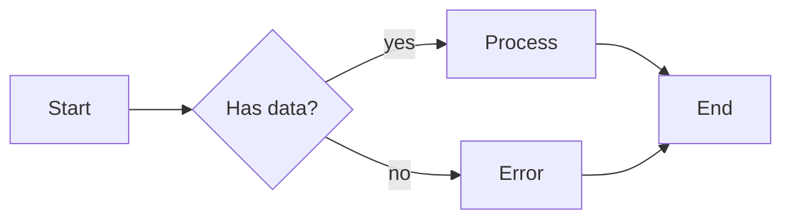
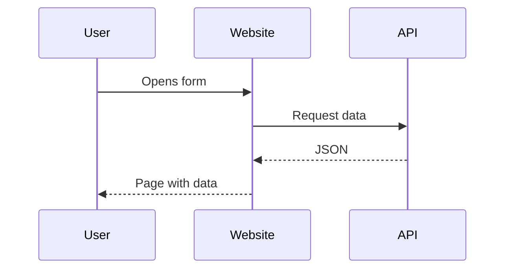
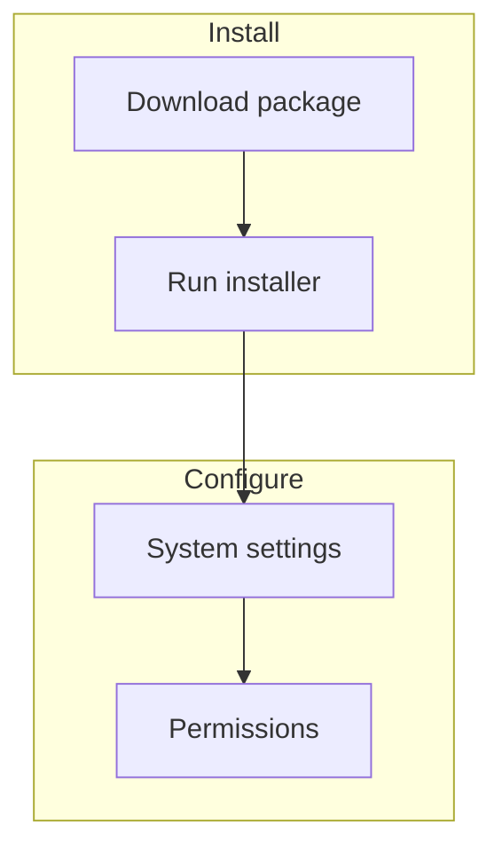
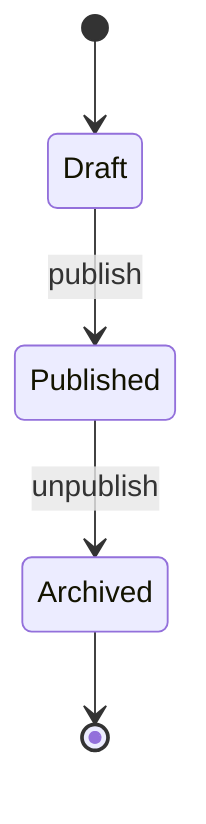
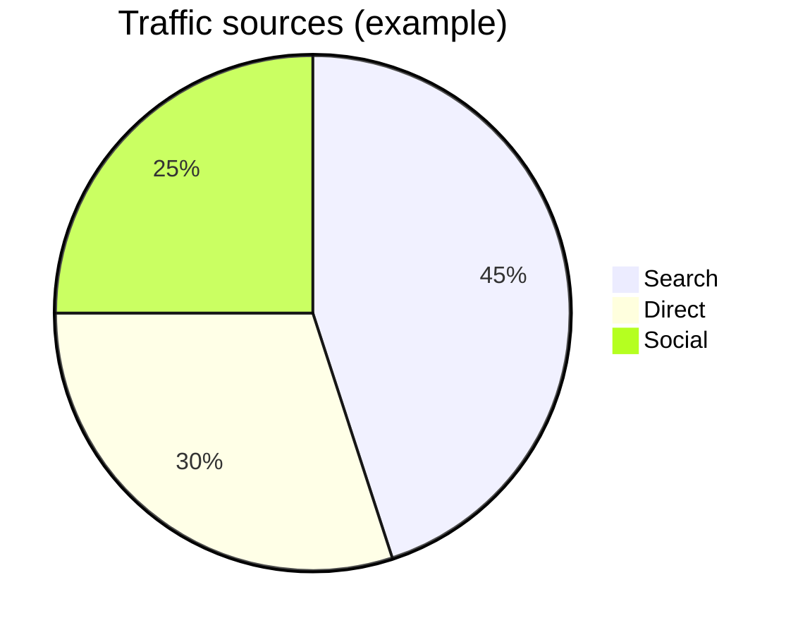
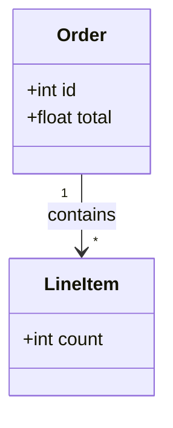

# Mermaid diagrams

[Mermaid](https://mermaid.js.org/) is a text-based diagram language: flowcharts, sequence diagrams, state diagrams, and more. In this project, diagrams are **written as code** in Markdown; VitePress renders them when the site is built.

This is already wired up ([vitepress-plugin-mermaid](https://github.com/emersonbottero/vitepress-plugin-mermaid), Mermaid 11). Add a fenced code block to any `.md` file.

## How to embed a diagram

1. Open the Markdown file you want to edit.
2. Add a fenced block with the language tag **`mermaid`** (three backticks, the word `mermaid`, newline, diagram code, closing three backticks).

You can also use **`mmd`** as the language tag; the plugin treats it like `mermaid`.

Light and dark site themes are applied automatically.

## Minimal example (flowchart)

**In your Markdown source:**

````markdown

````

**Rendered on the site:**


Directions: `TB` top-to-bottom, `LR` left-to-right, `RL` right-to-left.

## Sequence diagram

Useful for “who calls whom” (APIs, queues, plugins).

````markdown

````


## Subgraphs (grouped steps)

````markdown

````


## State diagram

Good for order lifecycle, task status, etc.:

````markdown

````


## Pie chart

````markdown

````


## Simple class diagram

````markdown

````


## Tips

- Full syntax and more diagram types: [Mermaid documentation](https://mermaid.js.org/intro/) (ER, Git graph, Gantt, journey, …).
- If a diagram does not render, check indentation, that the closing fence is present, and keywords (`flowchart`, `sequenceDiagram`, etc.).
- Prefer several small diagrams over one huge chart — easier to read and maintain.
- Cyrillic labels usually work; if rendering looks wrong, shorten node text or use short `id` values with `participant X as Label`.

See also [VitePress features](/en/guide/vitepress#mermaid-diagrams) for a short cross-reference.
