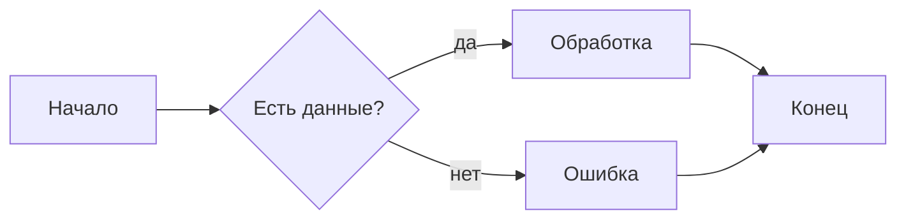
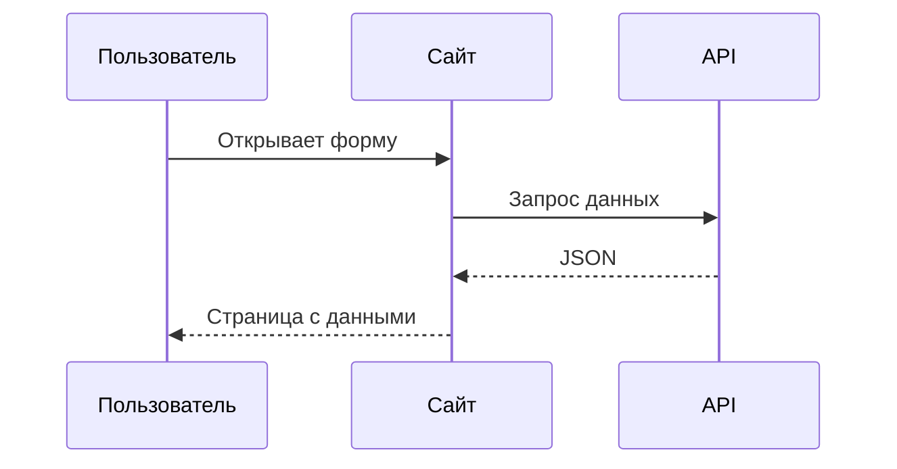
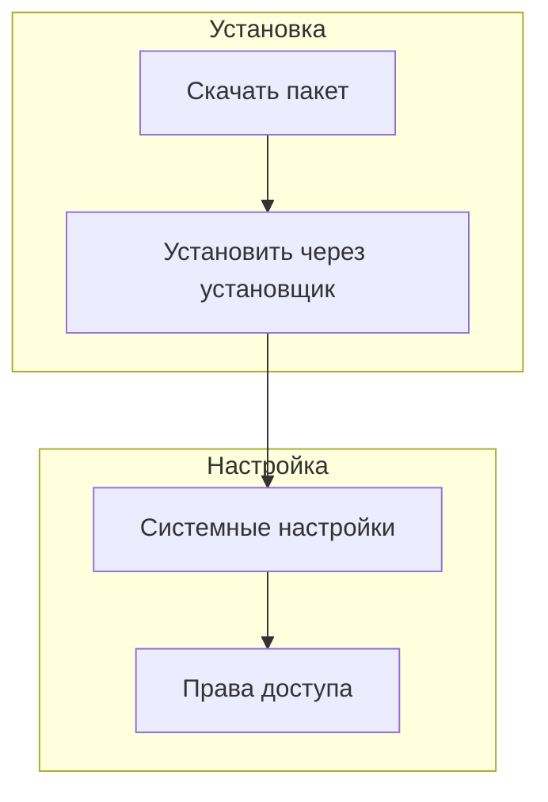
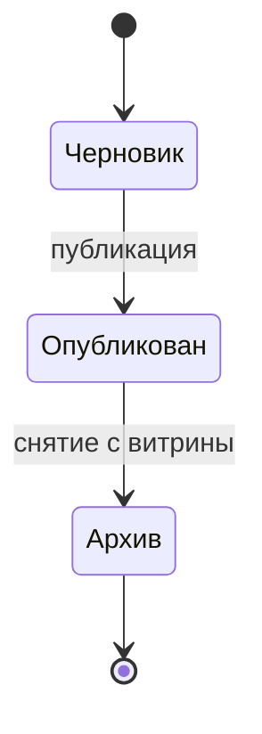
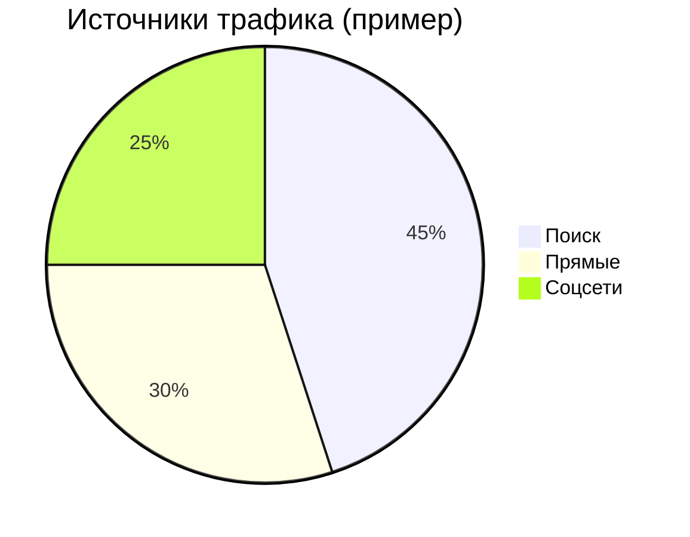
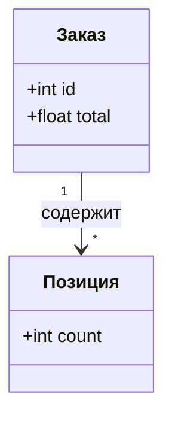

# Диаграммы Mermaid

[Mermaid](https://mermaid.js.org/) — это текстовый язык для схем: блок-схемы, последовательности вызовов, простые диаграммы состояний и т.д. В документации проекта диаграммы **не рисуются картинкой**, а описываются кодом в Markdown — при сборке сайта VitePress их превращает в графику.

Подключение уже настроено ([vitepress-plugin-mermaid](https://github.com/emersonbottero/vitepress-plugin-mermaid), Mermaid 11). Вам достаточно добавить блок в `.md` файл.

## Как вставить диаграмму

1. Откройте нужный Markdown-файл.
2. Вставьте fenced-блок с подсветкой **`mermaid`** (три обратные кавычки, слово `mermaid`, новая строка, код диаграммы, снова три кавычки).

Альтернатива: язык блока **`mmd`** — плагин обрабатывает его так же, как `mermaid`.

Светлая и тёмная темы сайта подхватываются автоматически.

## Минимальный пример (блок-схема)

**Как писать в Markdown:**

````markdown

````

**Как это выглядит на сайте:**


Направление: `TB` — сверху вниз, `LR` — слева направо, `RL` — справа налево.

## Диаграмма последовательности

Удобно для сценариев «кто кого вызывает» (API, очереди, плагины).

````markdown

````


## Подграфы (группы в блок-схеме)

Удобно для этапов «установка / настройка / эксплуатация»:

````markdown

````


## Диаграмма состояний

Подходит для жизненного цикла заказа, статуса задачи и т.п.:

````markdown

````


## Круговая диаграмма (pie)

Доли в процентах, подписи через двоеточие:

````markdown

````


## Простая диаграмма классов

Когда нужно показать сущности и связи без UML в полный рост:

````markdown

````


## Советы

- Синтаксис и все типы диаграмм — в [официальной документации Mermaid](https://mermaid.js.org/intro/). Там же: ER, Git graph, journey и др.
- Если диаграмма не отображается, проверьте отступы, закрытие блока тремя кавычками и отсутствие опечаток в ключевых словах (`flowchart`, `sequenceDiagram` и т.д.).
- Для сложных схем лучше разбить на две простые страницы или две диаграммы — так проще читать и править.
- Подписи на кириллице обычно работают; при странном отображении попробуйте упростить текст в узлах или взять короткие `id` в `participant X as Подпись`.

См. также раздел [«Диаграммы Mermaid» в возможностях VitePress](/guide/vitepress#mermaid-diagrams).
